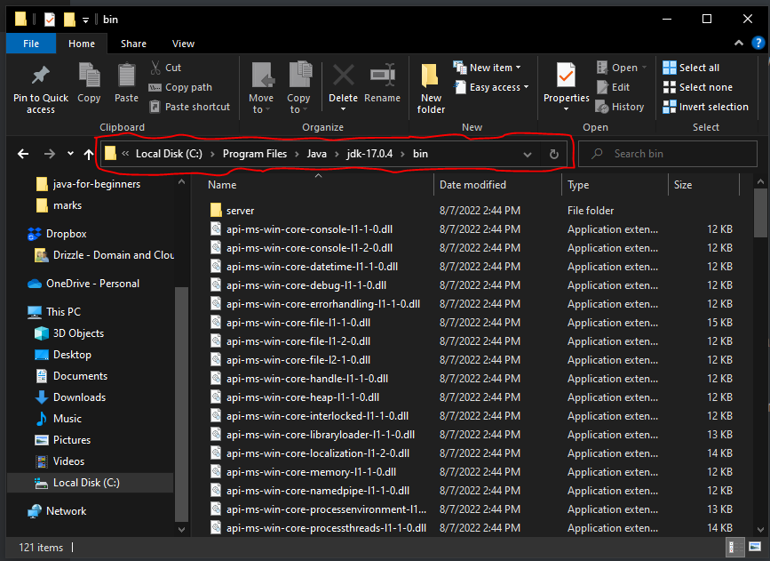

# Java At First Look

Welcome to Java programming, I hope you are ready to learn one of the most awesome, and most used programming languages for building real-time applications. 

I hope your read all the materials in the `101-programming`. if yes then you are in good shape. 

*Prerequisite: You must have solid programming knowledge. considered you covered materials in `101-programming`*

[TOC]


## What Are We Going To Do

* We will talk a little more about Java(brief history),
*  The use cases of Java
* Why should you learn Java?
* How to download Java from the internet and more about JKD
* How to setup your development environment,
*  Command line versus IDE.

### What is Java

Java is an **Object-Oriented Programming Language** developed by **sonny Microsoft** in 1992. 

### Uses Of Java

* Java is used to build rich enterprise applications.
* Android operating system is built on Linux with Java
* Java is used in Android app development
* Web development(build web server and web APIs)
* Internet of things and embedded devices
* Banking applications and ATM systems

### Why Should You Learn Java

Java is a well-respected language with many benefits. The uses mentioned above make Java an excellent choice for those considering a career in programming. It is also a great language to start your programming journey with due to its strictness. We will explore why Java is considered a *strict language*.

### How To Download Java

Well, there are many resources available on the internet, but I recommend using **Oracle** since they maintain Java. Java has evolved significantly, with many new features added to the language.

Java 22 is the newest version as of now, but I recommend downloading Java 21. Java 21 is the current standard version and comes with long-term support (LTS). 

What do I mean by long-term support(LTS):
Software development involves updating existing features, adding new ones, and deprecating outdated ones. Every software goes through these phases, and Java is no exception. Java 21 includes the latest updated features that have been thoroughly tested and are free from bugs, making it suitable for real-time software development. However, the newest version, Java 22, does not have long-term support (LTS).

A version that does not have long-term support is released to the general public for testing. People will use it, report any issues, and the maintainers will fix those issues. These kinds of versions are not typically used by companies or individuals to build software.

To download Java on your Computer please follow this link [download java 17](https://www.oracle.com/in/java/technologies/downloads/#jdk17-windows), select your OS type , and proceed with your download.

### Why Do You Need To Download And Install Java 

To execute Java code on your computer, you need to install Java, which includes the Java Development Kit (JDK). Without the JDK, you will not be able to run Java code on your machine.

The JDK comprises other essential software, including the Java Virtual Machine (JVM) and the Java Runtime Environment (JRE)

Java Virtual Machine (JVM): This helps execute our bytecode or object code. As we discussed earlier, computers only understand machine code (low-level language), whereas Java is a high-level language. The JVM processes our bytecode into machine code so the CPU can execute it.

Java Runtime Environment: This contains classes and libraries with predefined logic. We will use these predefined classes and libraries in our Java program later on.

### Set Up Your Path 

Now we successfully downloaded and installed Java it's time to set up our development environment aka dev environment. We need to tell our computer where to find the Java we installed. *This is for only people running Windows computers* Mac OS and Linux take off everything.

In steps: 

* Open your window file explorer.

* Navigate to your C drive.

* Open your `program files` folder(this folder contain your installed programs).

* Find a folder named `Java` and open it.

* You should see one folder named `jdk-` with the version you installed in our case is 21, and open it suppose you've downloaded Java-21

* You will see a list of sub-folder and files, among you, should see a folder with the name of the `bin`, open the `bin` folder.

* Inside the `bin` folder, there are lots of sub-folders and files. See the preview:
  * 

* Click on the highlighted red color shown in the image above it will highlight everything in that address bar(think of it like how you copy a URL in your browser). `Ctrl+c` copy to highlighted text.

* Now we have to go to our Environment variables, press the `Windows key,` and type `env` you see 'Edit the system environment variables', and press on Enter key to open it.

* Advance tap will be selected by default, at the bottom you should see a button `Environment Variables` Click on it another window will open.

* There you will see the `User variables `(this will set the path to the only logged user), and System Variables(which will set the path for the entire system, and any user can access it). I prefer the `System Variables`.

* On the `System, Variables` select the `path` and click the `edit button `. Another small window will pop up. If it doesn't show like the image below go to the second instructions after the image.
  * The way my system shows it: 

  * 

  * You might not see all of the paths like the above, but it's ok. Click the `New` button a text area will be below the path, paste using `Ctrl+v` and then `Ok`.

  * The other way; all the paths will appear in one line separated by a semicolon. The last path might not have a semicolon at the end, but you have to put a semicolon before you can add any other path after it.

  * Add a to the last path, paste `Ctrl+v,` and then OK. That's it.

### Verify Java 

These are for all Operating Systems. Let's see whether Java is successfully installed on our computer. 

* Open your terminal or command prompt(on Windows: `windows key + r` then type cmd and OK)
* Type `java -version` and press on `enter key` this should show you the version of Java you have installed. Our case will be `java version "21" Date and  LTS`.
* Type `java` and press on the `enter key` a man-page will appear with some other useful commands. Believe it or not, we are done.


### Java On The Command Line

Before we finally install an Integrated Development Environment aka IDE to write and compile our Java code we will learn how to use the command line with a notepad to write our first Java program.

Tip: If you're using Windows I highly recommend you download and install [git](hppt://git-scm.com) which comes with a `bash terminal` the wWindowsPowerShell or the command prompt in some Windows computers cannot run some bash commands. The `bash` is the default for Mc OS and Linux, so therefore, if you're on Mc or Linux life is good! 

Let's get into it:

* Let's begin by creating a directory/folder on our Desktop preferably named it java.

* Mac and Linux: Search for the terminal from your launcher and open it.

* Windows: Press on the `Windows key`, type `Git Bash`and open it.

* You want to make sure these two windows and next to each other meaning: both should be visible to you on your screen:

  * 

* Type `cd` in your terminal or Git Bash and then space

* Drag and drop your Java folder in the terminal or Git Bash. You should see something like this 'cd C:\Users\ebrima\Desktop\java' then click on the enter key this should take you to the java directory/folder.

* Let's confirm we are sitting in the right directory, type `pwd` and these should show up as `/c/Users/ebrima/Desktop/java`. Of course a different username, mine is ebrima.

* Type `touch Main.java` and press enter this will create a file name Main or Main.java.

* Run the `ls` command to see the file you just created.

* You can double-click on the file to open it with Notepad in your File Explorer or use the terminal by typing the name of your text editor and the file name with the file extension. `notepad Main.java` and enter on Windows. On Mac and Linux refer to your default text editor.

* Copy the following code snippets and paste them into your file opened in Notepad then `Ctrl+s` to save.

  ```java
  public class Main {
  	public static void main(String[] args){
  	System.out.ptintln("Hello World!");
  }
  }
  ```

* Run `cat Main.java` this will preview the content of the file in your terminal or Git Bash. Now we are in good shape, let's try to compile this code by invoking the java-compiler.

* Run `javac Main.java` in your terminal or Git Bash. Hope you do not see anything coming out? that's perfect because your code has been compiled successfully.

* Run `ls` you see two files all named Main but with different file extensions (.java, and .class).

* Now is the time to execute our code to see the print message. Run `java Main.java ` or just `java Main` not `Main.class`.

* Congratulations if you see Hello World! printed in your terminal or Git Bash

* Let's modify our program a bit, move to Notepad, copy the code below, and paste the code below the first print statement.

* ```java
  System.out.println(2+2)
  ```

* Save it go to your terminal and run `javac Main.java` to compile it again. Am sure this time an error is going to be thrown at you because we don't terminate `;` the print statement we just added. Have spotted it?

* Correct the error, save it, compile it, and execute it you should see Hello World! and 4.

## Install An IDE

Well, learning Java requires having an IDE(integrated development environment). This will help us with many things like syntax highlighting, code formatting, suggestions, and many more.

I will be using IntelliJ IDE, but you can use any IDE of your choice. To download IntelliJ [navigate to the official site](https://www.jetbrains.com/idea/download/#section=windows), and make sure you download the Community Edition(free for everyone to download and use, the ultimate is paid).

Upon installing IntelliJ IDE you check 'set path, and check java for language'. That should be good.

[Next lesson](https://github.com/touraye/under-doz/blob/main/102-looking-into-java/L-102-basic-building-block.md)

[Previous lesson](https://github.com/touraye/under-doz/blob/main/101-programming/L102-getting-to-programming.md)
