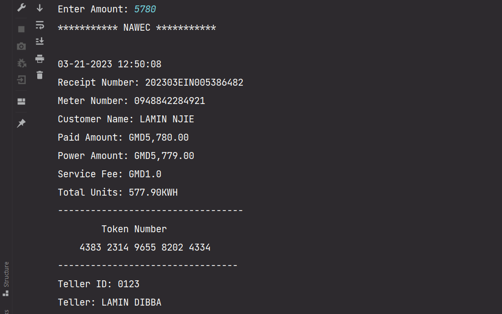
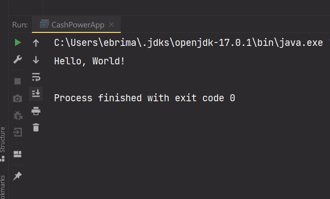
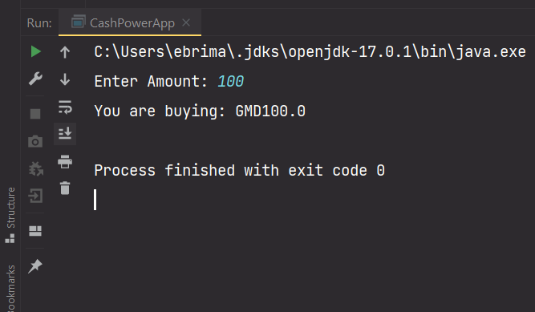
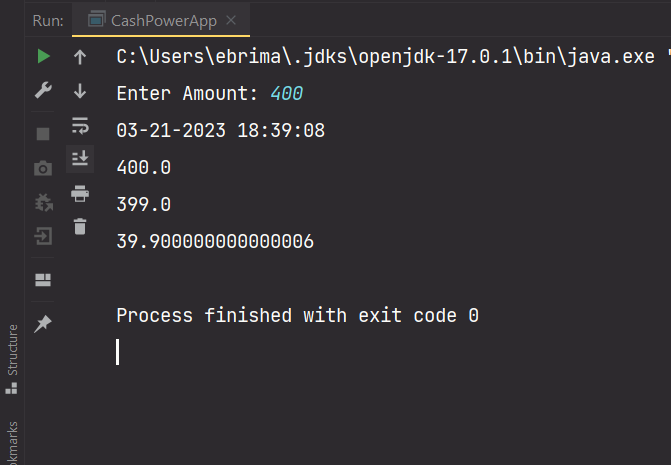
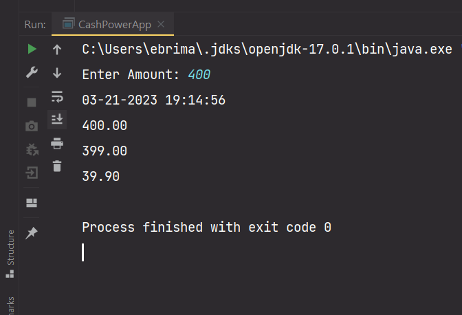
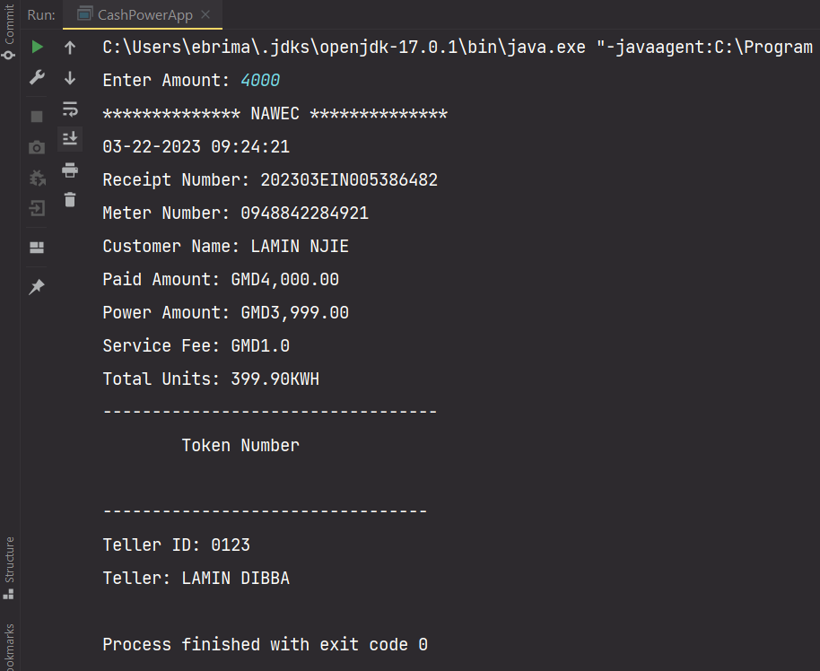
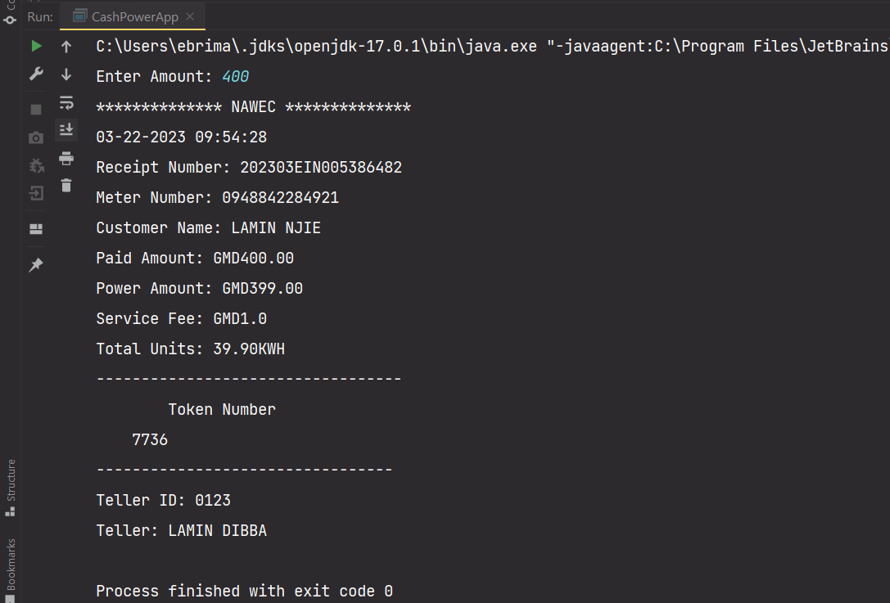
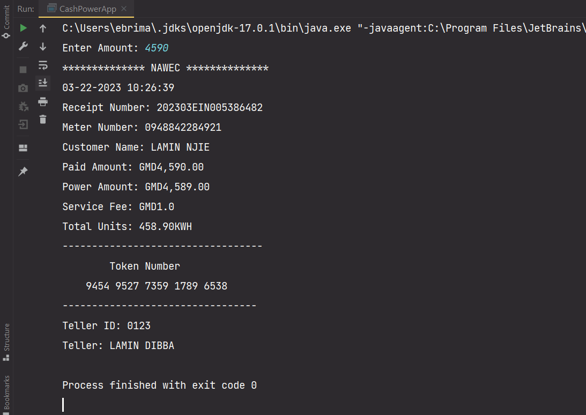
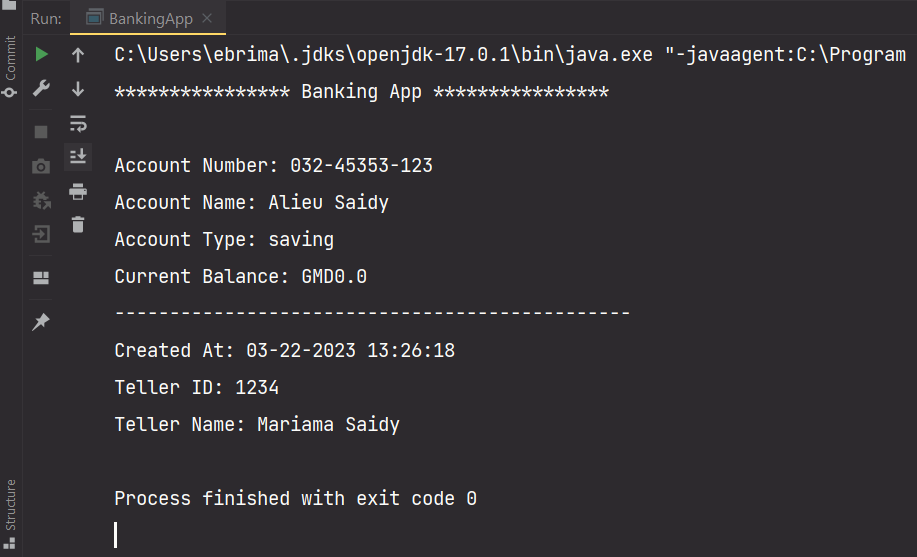
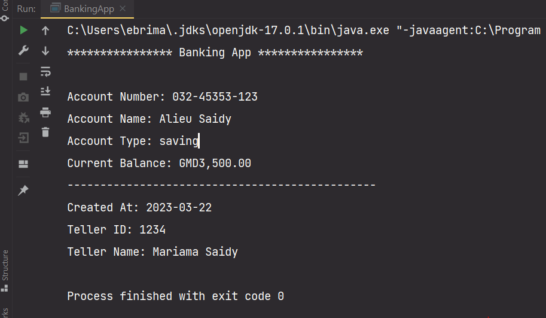

## Cash Power Application

Learning by building projects is the best way to learn any programming language. Here we will bring all the knowledge we gain from the previous lessons. Make sure you went through all lessons!

The look of our finish application:



New things to learn are:

* Taking input from the user's keyboard
* Date

## Taking Input from the User Keyboard

To get input from user's keyboard we will use the Java Scanner class. This class helps us read data from the user including files, but here our focus is on taking data from user's keyboard. To do that we have to create a new Scanner object

```java
Scanner input = new Scanner(System.in);
```

*Note! if you copy and paste the code above you might see a red underline underneath `Scanner` just point your mouse pointer over it and a hint will appear to import class, click import class*

The `Scanner(System.in)` constructor requires an argument, and there we are specifying that we want to read from the keyboard. We read data from the user keyboard in primitive data types and String by also specifying the method.

The code snippet below will put your program on pause until and unless you type in some text with your keyboard and press `enter` on your keyboard. Your cursor should be bilking in the console(click in where in the console) then start typing.

```java
Scanner input = new Scanner(System.in);
input.next(); 
```

This method is going to return a String data type whatever typed by user from the keyboard. As we mentioned above that you can use it to read any other primitives as well. It's easy to know the return type of any method, by using the dot `.` on the object variable this case is `input`.

**Better usage**

Program should make clarity, it is better to tell user what to do. In our example above is not an elegance way of taking input from user because we do not prompt user what to do. Let's see how to modify this little program a bit.

```java
Scanner input = new Scanner(System.in);
System.out.print("Enter your name: ")
input.next(); 
```

The above code is better than the previous, because user is prompted what to do. We can even make our program better by assigning the value we grad from the keyboard to a variable that way we can do something with it later in our program.

```java
Scanner input = new Scanner(System.in);
System.out.print("Enter your name: ");
String name = input.next();
System.out.print("Name: " +name);

// Name: what you typed will print in the console
```

*If you want to grab int `input.nextInt()`, double `input.nextDouble();`, boolean `input.nextBoolean();` etc.*

## Working With Dates

Date is an essential part of programming especially when working with program that deal with time. Java provides so many way of interacting with date.

Let's see the various Date Java provides:

Before we begin I want you to have this import statements at the top of class declaration:

```java
import java.time.Instant;
import java.time.LocalDateTime;
import java.time.format.DateTimeFormatter;
import java.util.Calendar;
import java.util.Date;
```

*Tip: Create class `DateAndTime`, copy and past the above import statements, and create a `main()`method*

```java
Date date = new Date();
System.out.println("Date: " +date)
// Tue Mar 21 07:55:51 PDT 2023
System.out.println("Date: " +date.toLocaleString())
// Mar 21, 2023, 7:55:51 AM
    
    
LocalDate localDate = LocalDate.now();
System.out.println("local date: " +localDate);
// 2023-03-21


LocalDateTime currentDateObject = LocalDateTime.now();
DateTimeFormatter myDateFormat = DateTimeFormatter.ofPattern("dd-MM-yyyy HH:mm:ss");
System.out.println("Before formatting: " +currentDateObject);
// 2023-03-21T08:09:15.268799400
String formattedDateObject = currentDateObject.format(myDateFormat);
System.out.println("After formatting: " +formattedDateObject);
// 21-03-2023 08:09:15
```

We can even format `currentDateObject` to a more human-readable format

```java
LocalDateTime currentDate = LocalDateTime.now();

DateTimeFormatter format1 = DateTimeFormatter.ofPattern("yyyy-MM-dd");
DateTimeFormatter format2 = DateTimeFormatter.ofPattern("dd/MM/yyyy");
DateTimeFormatter format3 = DateTimeFormatter.ofPattern("dd-MMM-yyyy");
DateTimeFormatter format4 = DateTimeFormatter.ofPattern("E, MMM dd yyyy");

String f1 = currentDate.format(format1);
String f2 = currentDate.format(format2);
String f3 = currentDate.format(format3);
String f4 = currentDate.format(format4);

System.out.println("f1: " +f1);
// 2023-03-21
System.out.println("f2: " +f2);
// 21/03/2023
System.out.println("f3: " +f3);
// 21-Mar-2023
System.out.println("f4: " +f4);
// Tue, Mar 21 2023
```

Let see what the Calendar class provides

```java
Calendar calendar = Calendar.getInstance();
//set month
calendar.set(Calendar.MONTH, 5);
calendar.set(Calendar.DATE, 12);
calendar.set(Calendar.YEAR, 2021);
Date myDate = calendar.getTime();
System.out.println("initial: " +myDate);
// initial: Sat Jun 12 09:02:11 PDT 2021
Instant instant = myDate.toInstant();
System.out.println("int: " +instant);
// intant: 2021-06-12T16:02:11.486Z

// set your custom date //
Calendar calendar2 = Calendar.getInstance();
System.out.println("Current Year: " +calendar2.get(Calendar.YEAR));
// Current Year: 2023
System.out.println("Current Month: " +calendar2.get(Calendar.MONTH));
// Current Month: 2
System.out.println("Current Month: " +(calendar2.get(Calendar.MONTH) + 1));
// Current Month: 3
System.out.println("Current Day of the month: " +calendar2.get(Calendar.DAY_OF_MONTH));
// Current Day of the month: 21
System.out.println("Current Date: " +calendar2.get(Calendar.DATE));
// Current Date: 21
System.out.println("Current Day of the week: " +calendar2.get(Calendar.DAY_OF_WEEK));
// Current Day of the week: 3

calendar2.set(2023,2,12);
Date d = calendar2.getTime();
System.out.println("Cal2: " +d);
// Cal2: Sun Mar 12 09:43:04 PDT 2023
```

*The first month is `0` and the last month is `11` in programming. Is a good practice to add 1 to the month value as you can see in the above expression `(calendar2.get(Calendar.MONTH) + 1)` which will result to `3`. The time of writing the month is March, which is the third month of the year. As for you case anytime you are reading this material it will work out for you.*

**Let's continue with our application**

First thing to think is the algorithm, it's good practice understanding the problem then you find a solution to in code:

* We need to ask user to enter the amount they wish to buy and store it into a variable
* To be able to read from user's keyboard we need a Scanner object
* We need to store the following values as well: `tellerID`, `KWH`, `amount`, `powerAmount`, `totalUnits`, `servieFee`, `tokens`, `currentDate`
* For the date we will use the `LocalDateTime` object with the `now()` method to get the current date from the system.
* The `DateTimeFormat` object to format the date we want by passing the pattern to the construct as argument.
* Service fee `1` dalasi meaning upon all the transactions `1` dalasi will be deducted.
* The power amount(actual amount to buy cash power) is gain when service fee is deducted from the `amount`.
* The `totalUnits` is gain by multiplying `powerAmount` and `KWH`. 
* As for the token we use the `Random` object with `nextInt()` method to generate random 4 digits every time we run our application.
* The token are of 20 digits, so we need generate 4 digits five times and use concatenation technique to bind all into one giant `String`

That's it for the algorithm.

One nice thing about creating a console application is that you don't need to run any command or to install any dependencies. All we need to do is to create a new Java project called `CashPowerApp`

With a new Java class with the same name as your project:

```java
public class CashPowerApp {
	public static void main(String[] args) {
        System.out.print("Hello, World!");
    }
}
```

*Note: Start small and proceed, fixing bugs in a smaller application is easier than in a larger application*

Let's run to test our application is working perfectly:



Wow! you are set if you see the above in your console.

Let's modify our application by implementing a Scanner object to take input from user keyboard:

```java
import java.util.Scanner;

public class CashPowerApp {
	public static void main(String[] args) {
	     Scanner input = new Scanner(System.in);
         System.out.print("Enter Amount: ");
         double amount = input.inextDouble();
         System.out.println("You are buying: GMD" +amount);
    }
}
```

Run your program:



That's perfect we are interacting with our program, taking input and giving out output.

Now is a good time to come up with data type to store some static values. It's never easy to determine the type for a variable at the beginning. Put that in mind any value you won't perform any computations(arithmetic operations) on it consider putting it into a `String`. Be it a value that consist of numbers for our case: `meterNumber` we do not need to do any computation on it.

Let's modify our code:

*  Creating`LocalDateTime` object and invoking the `now()` method to get current date from the system
* Creating `DateTimeFormatter` objects, and invoking the `ofPattern()` method and passing the pattern as an argument
* Setting the pattern for our date format, and invoking the `format()`method then we pass our pattern object `dateFormatPattern` as an argument 
* We also assigned values to some variables while others without values
* Note we are using the `final` keyword to denote a constant on some variable
* The variables without an initial value their values will be computed later

```java
import java.time.LocalDateTime;
import java.time.format.DateTimeFormatter;
import java.util.Scanner;

public class CashPowerApp {
    public static void main(String[] args) {
        Scanner input = new Scanner(System.in);
        LocalDateTime currentDate = LocalDateTime.now();
        DateTimeFormatter dateFormatPattern = DateTimeFormatter.ofPattern("MM-dd-yyyy HH:mm:ss");

        String formattedDate = currentDate.format(dateFormatPattern);
        String recieptNumber = "202303EIN005386482";
        String meterNumber = "0948842284921";
        String customer = "Lamin Njie";
        String tellerID = "0123";
        final double KWH = 0.1;
        double serviceFee = 1;
        double powerAmount;
        double totalUnits;

        System.out.print("Enter Amount: ");
        double amount = input.nextDouble();
    }
}
```

Compute the values of unassigned variables:

1. `powerAmount` variable is gain when we deduct the actual `amout` from the `serviceFee`
2. `totalUnits` is gain by multiplying `powerAmount` with `KWH`

Let modify our code once again:

```java
import java.time.LocalDateTime;
import java.time.format.DateTimeFormatter;
import java.util.Scanner;

public class CashPowerApp {
    public static void main(String[] args) {
        Scanner input = new Scanner(System.in);
        LocalDateTime currentDate = LocalDateTime.now();
        DateTimeFormatter dateFormatPattern = DateTimeFormatter.ofPattern("MM-dd-yyyy HH:mm:ss");

        String formattedDate = currentDate.format(dateFormatPattern);
        String recieptNumber = "202303EIN005386482";
        String meterNumber = "0948842284921";
        String customer = "Lamin Njie";
        String tellerID = "0123";
        final double KWH = 0.1;
        double serviceFee = 1;
        double powerAmount;
        double totalUnits;

        System.out.print("Enter Amount: ");
        double amount = input.nextDouble();
        powerAmount = amount - serviceFee;
        totalUnits = powerAmount * KWH;
    }
}
```

We are almost there, but we might need to test our program hence we have added lots of code to it.

Let's do this by printing `formattedDate`, `amount`, `powerAmount`, and `totalUnits`:

Run and compile your code, and if your code is alright then it should look exactly like the demo below:



Congratulations, but we can still need to make our app better. We need to format our  `amount`, `powerAmount`, and `totalUnits` values:

1.  We can use the `format()` method on the String object to format our monetary values.
2. The `format()` method takes two arguments: the first argument is the pattern you wish to format, and second argument is actual value to want to format.
3. The `totalUnits` is a giant figure, and we only need to two place after the decimal point.
4. We are going to use the `DecimalFormtter` object and pass the pattern to its constructor as an argument.

Let's modify our code one more time:

```java
import java.text.DecimalFormat;
import java.time.LocalDateTime;
import java.time.format.DateTimeFormatter;
import java.util.Scanner;

public class CashPowerApp {
    public static void main(String[] args) {
        Scanner input = new Scanner(System.in);
        LocalDateTime currentDate = LocalDateTime.now();
        DateTimeFormatter dateFormatPattern = DateTimeFormatter.ofPattern("MM-dd-yyyy HH:mm:ss");
        DecimalFormat decimalFormat = new DecimalFormat("0.00");

        String formattedDate = currentDate.format(dateFormatPattern);
        String recieptNumber = "202303EIN005386482";
        String meterNumber = "0948842284921";
        String customer = "Lamin Njie";
        String tellerID = "0123";
        final double KWH = 0.1;
        double serviceFee = 1;
        double powerAmount;
        double totalUnits;

        System.out.print("Enter Amount: ");
        double amount = input.nextDouble();
        powerAmount = amount - serviceFee;
        totalUnits = powerAmount * KWH;

        //testing:
        System.out.println(formattedDate);
        System.out.println(String.format("%,.2f", amount));
        System.out.println(String.format("%,.2f", amount));
        System.out.println(decimalFormat.format(totalUnits));
    }
}
```

Execute your program:



Awesome! our app is almost there let's print more information. Concatenation make a program more readable.

Let's modify one more time with some additional print statements and concatenations:

```java
System.out.println("************** NAWEC **************");
System.out.println(formattedDate);
System.out.println("Receipt Number: " +recieptNumber);
System.out.println("Meter Number: " +meterNumber);
System.out.println("Customer Name: " +customer.toUpperCase());
System.out.println("Paid Amount: GMD" +String.format("%,.2f", amount));
System.out.println("Power Amount: GMD" +String.format("%,.2f", powerAmount));
System.out.println("Service Fee: GMD" +serviceFee);
System.out.println("Total Units: " +decimalFormat.format(totalUnits)+"KWH");
System.out.println("----------------------------------");
System.out.println("\t\tToken Number \n \t");
System.out.println("---------------------------------");
System.out.println("Teller ID: " +tellerID);
System.out.println("Teller: LAMIN DIBBA");
```

*Note: we are using `"\t"` to make a single tab, and a line break with `"\n"`*

Made the changes, compare yours with below demo:



One last thing to fix is the token. As we mention above in our algorithm, we need `20` digits for the token. It is time to include the `Random` object.

You can copy and the import of `Random` class `import java.util.Random;` at imports above:

* To create new `Random` object we need instantiate the `Random` class

* Create a new `Random` object just after the `DecimalFormat` object

* ```java
  Random random = new Random();
  ```

* Next is to invoke the `nextInt()` method hence we want get `int` values, and pass the `bound` as an argument.

* ```java
  int random4Digits1 =  ran.nextInt((9999 - 100) + 10) + 10;
  ```

* The bound `(9999 - 100) + 10` is the argument we're passing and also adding `10` to it. This will generate four unique numbers each time you execute your program.

Let's run our app one more time and print the `random4Digits1` variable where `token` purpose to be:



We got our first four digits printed out. How do we print out `20` digits randomly? If you want to challenge yourself I highly recommend that.

Let's finish it up:

* As we need `20` digits to represent our tokens, and we are printing only `4` digits in one variable as for now

* We need to generate `4` random digits four more time to make get `2o` digits

* ```java
  int random4Digits1 =  random.nextInt((9999 - 100) + 10) + 10;
  int random4Digits2 =  random.nextInt((9999 - 100) + 10) + 10;
  int random4Digits3 =  random.nextInt((9999 - 100) + 10) + 10;
  int random4Digits4 =  random.nextInt((9999 - 100) + 10) + 10;
  int random4Digits5 =  random.nextInt((9999 - 100) + 10) + 10;
  
  String tokens = random4Digits1+ " " +random4Digits2+ " " +random4Digits3+ " " +random4Digits4+ " " +random4Digits5;
  ```

* The `tokens` variable will hold all the `20` digits random number in a giant String with space between very fourth digits
* The random numbers are of type `int` and we are assigning it to `String` value
* Java will something called `autoboxing`, it will change the `int` value to a `String`. Well learn more about casting in the coming lessons

Suppose you updated your code with above code and also replace `random4Digits1` in the print statement with `tokens`.

The complete version:



Congratulation on completing the **Cash Power App**. It is a long one, but software is a step by step thing, and hope you have learned something new.

## Exercise 103

In this exercise you will start developing a Banking Application, with very few features, and you carry on with the flame until you end up with real one. Here you will do a real-time software development.

You will begin building the skeletal bit by bit.

1. First by creating new project `BankingApp` precisely 
2. Create a new class which is going to reside in your `src` directory
3. In your class declaration create a `main()` method, and print out a text to the console which says `"Banking App"`
4. 
5. Let's talk about what is need for the Banking App: As for now it only needs to store:
   1. Account name, full-name of the account holder
   2. An account number
   3. Account type can be saving for now
   4. Current balance to store current balance. The Banking allows people creating account with zero dalasi
   5. Account creation date
   6. The teller's name and ID
6. After finishing with the above task run and compare with demo below:
7. 
8. Modify your program and make it possible to add an update to your `currentBalance` 
   1. Create a variable called `deposit` assign `5000` to it
   2. Use the `deposit` value and update your `currentBalance` 
   3. Run your program `currentBalance` value will be updated to `5000`
   4. Create a variable called `withdrawal` and assign `1500` to it
   5. Use the `withdrawal` value and update your `currentBalance` 
   6. Run your program `currentBalance` value will be updated to `3500`
9. The App need to some more update: the `createdAt` value should be a specify time rather you are getting the current system time whenever you run your app. Set it to a `2023-03-22` preferably and make the variable a constant
10. Format your money value for example `1200` should be formatted as `1,200.00`

Your finish App you look like:



 

[Next lesson](https://github.com/touraye/under-doz/blob/main/102-looking-into-java/L-108-decisions.md)

[Previous lesson](https://github.com/touraye/under-doz/blob/main/102-looking-into-java/L-106-Arithmetic-operation-and-math-class.md)
