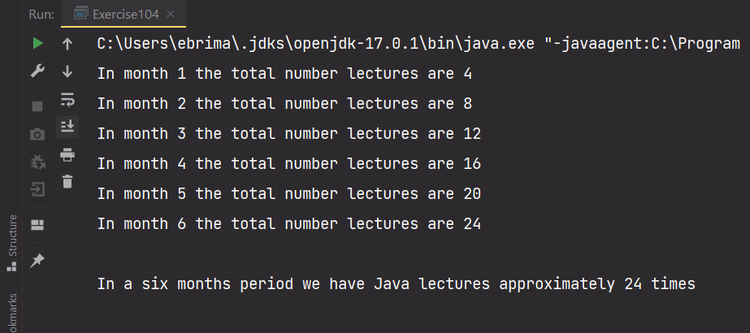

# Loops in Java

In [lesson-101]() we talked about the common patterns found in almost every software, and these patterns are input, output, math, condition, and repetition. In the previous lessons we looked at all the other patterns expect repetition.

Printing a message to the console two times can be simply done by write a print statement twice. But, what of a hundred times. How many times will you write a print statement in your program, will you even do it correctly?

## Loop

With repetition, we can print a hundred print-statements with just few lines of code. This refers to as loops, loops helps us to repeat part of a program multiples times base on a condition. In Java there are three types of loop namely `for loop`, `while loop`, a `do while loop`, `advance for loop`

*Note! We look at advance for loop in the later lesson when we start dealing with ArrayList*

## For Loop

A for loop in Java has three statements: 

```java
for(statement1; statement2; statement3){
    //block of code to executed
}
```


1. Statement1: defines a variable(counter variable) that will set the initial counter for the loop, this happens one time before the loop start
2. Statement2: defines the condition that control the loop using a comparison operator, the loop will continue executing as long as the condition is true, and it is stop whenever the condition is false.
3. Statement3: update the counter variable of a loop either by incrementing or decrementing, it execute only when body of the loop execute.

It might sound funny statement3 execute after when the body of the loop executes. Yes, this how a for loop work. We will see that in the examples.

Let see:

```java
for (int counter = 0; counter < 10; counter++){
    System.out.println(counter);
}

// 0 , 1, 2, 3, 4, 5, 6, 7, 8, 9
```

A for loop without update to the counter variable

```java
for (int counter = 0; counter < 10;){
    System.out.println(counter);
}
// infinite loop
```

In the above code snippets(loop) the condition is always true `counter < 10` when counter is `0`. You can see the importance of the update(increment or decrement) statement.

#### Placing the Update Statement Better

The third statement of the loop can place many ways in, but there are best practices to that:

```java
for (int counter = 0; counter < 10;){            
        System.out.println(counter);
        counter++;
}
// 0 , 1, 2, 3, 4, 5, 6, 7, 8, 9
```

The above is another good way of placing the update statement.  I see it more beginner freely that placing it immediately after the condition(second statement).

The wrong way, these would not give you any syntax error, but a logical error:

```java
for (int counter = 0; counter < 10;){
    counter++;
    System.out.println(counter);
}
// 1, 2, 3, 4, 5, 6, 7, 8, 9, 10
```

We expect to start printing from `0` instead `1` and to stop at `9` instead `10` because we were updating the `counter` before printing it. `counter` is `1` before it is printed.

Let's try one example with:

```java
String myName = "alieu";
for (int counter = 0; counter < myName.length(); counter++){
    System.out.println(counter);
}
// 0, 1, 2, 3, 4
```

The above example uses the length of `myName` variable as we learned that String has a `length()` method that will return number of characters found in that String variable as an integer.

We can also print the characters found on `myName` variable using 	 for loop

```java
String myName = "alieu";
for (int counter = 0; counter < myName.length(); counter++){
    System.out.println(myName.charAt(counter));
}
// a l i e u

String myName = "alieu";
for (int counter = 1; counter < myName.length(); counter++){
    System.out.println(myName.charAt(counter));
}
// l i e u
```

*Note: is always advisable to start counting from `0` when iterating over a String because their index start from `0`*

Let's change the wheel and reverse:

```java
for(int i = 10; i >= 0; i--){
    System.out.println(i);
}
// 10, 9, 8, 7, 6, 5, 4, 3, 2, 1, 0
```

*Note: the update variable is either going to increment or decrement*

##### A loop in A Loop

This type of loop is called a nested for loop where a loop is place in the body of a loop. The outer loop embed the inner loop.

```java
for(int i = 1; i <= 3; i++){
    System.out.println(i);

    for (int j = 1; j < 2; j++){
        System.out.println("A B C");
    }
}
//1 A B C 
// 2 A B C
// 3 A B C
```

The outer loop is will execute 3 times, the inner will execute once at every instance of the outer loop. Meaning every time the outer loop execute the inner loop will also execute just once.

##### Some More Examples With Nested For Loop

Let's assume we go to school once every week for lectures, and our course is going to last for a  six-month period. How many times are we going to have lectures?

We can archive this with a nested for loop

```java
int courseDuration = 6; // 6 months course
int weeksInMonth = 4; // lectures happen
int lecturesDay = 0; // lectures count

// The outer loop will execute 6 times(6 months)
for(int month = 1; month <= courseDuration; month++){
    System.out.print("In month " +month+ " the total number ");
    // for every month we are going to school 4 times
    // The inner loop will execute 4 times in every 6 times
    for (int week = 1; week <= weeksInMonth; week++){
        //update the lecture days every week
        lecturesDay += 1;
    }
    System.out.println("lectures are "+lecturesDay);
}
System.out.println();
System.out.println("In a six month period we have Java lectures approximately " +lecturesDay+ " times");
```

The console message:



*We have utilized nested for loop to figure out the lecture days*

## While Loop

A while loop execute a block of code only if condition is `true`:

* The condition is wrap in a parenthesis `() `
* The block of code or the body of the loop will execute only when the condition is `true`
* The loop will keep on executing until when the condition is `false`

```java
while(false){
   System.out.println("Will this print?");
}
```

*The answer is `no` because the condition is `false`, but be mindful it will forever print if the condition is change to `true`*

We can also do the same count to 10 with `while loop`:

```java
int count = 1;
while(count <= 10){
   System.out.println(count);
   count++;
}
// 1, 2, 3, 4, 5, 6, 7, 8, 9, 10
```

The above code snippets  we start off with:

1. A variable that control the loop, it's initial value is `1`
2. A condition within a parenthesis that compare the variable that controls the loop against `10`, the condition `count <= 10` is true
3. In the body there is a print statement that print the value of `count`, and an expression that update `count` variable every time the loop execute/run
4. This two expression statements will keep repeating over and over until `count <= 10` becomes `false`

Let's use a `while loop` to print from `0 - 10` and use an if statement to determine which numbers are even and odd number.

```java
int count = 0;
while(count <= 10){
    if(count % 2 == 0)
        System.out.println(count+ " is an even number");
    else
        System.out.println(count+ " is a odd number");
   count++;
}
```

*Those Java accept code indentation like Python? Well this is not acceptable in Java try to wrap your if statement in curly brace*

## Do While Loop

Do while loop body execute first before the condition is checked.

```java
int counter = 0;
do {
    System.out.println("Do something");
    counter++;
} while(counter <= 5);
```

*As you see the body is wrapped in a `do{}` block that will do something before checking the condition in the `while()`*

Enough of boring examples let's start coding out login system in a `for`, `while` and a `do while` loop. 

The login system will allow users to try an attempt of 3 times if they forgot their credentials. After attempting 3 times we stop the program, and print to them a suitable error message.

### For Loop

```java
Scanner input = new Scanner(System.in);
System.out.println("****** Welcome to NekGambia ******");
System.out.println();

String username = "turner10";
String password = "javaman";

for (int i = 1; i <= 3; i++){
    System.out.print("Enter your username: ");
    String uName = input.next();
    System.out.print("Enter your password: ");
    String pWord = input.next();

    if(username.equals(uName) && password.equals(pWord)){
        System.out.println("Welcome to NekGambia");
        break;
    } else {
        System.out.println("Wrong credential! Please try again.");
    }
}
```

With a `for loop` user will be prompted to enter their credentials if they have entered the right credentials a welcome message will be printed in the console, and the program will terminate right there. And, if they fail for the first time they will be given two more chances to try with each an error message will be printed to the console. Remember the loop will run for only three times.

### While Loop

```java
Scanner input = new Scanner(System.in);
System.out.println("****** Welcome to NekGambia ******");
System.out.println();

String username = "turner10";
String password = "javaman";

int counter = 1;
boolean flag =  true;

while(flag) {
    System.out.print("Enter your username: ");
    String uName = input.next();
    System.out.print("Enter your password: ");
    String pWord = input.next();

    if(username.equals(uName) && password.equals(pWord)){
        System.out.println("Welcome to NekGambia");
        flag = false;
    } else {
        System.out.println("Wrong credential! Please try again.");
    }

    if(counter == 3) flag = false;

    counter++;
}
```

With a `while loop` user will be prompted to enter their credentials if they have entered the right credentials a welcome message will be printed in the console and the program will terminate right there.  And, if they fail for the first time they will be given two more chances to try with each an error message will be printed to the console.

New things:

* We register a `counter` variable that will help us to give track of how many times our loop run, and it's initial value is `1`
* A `flag` variable set to `true` which is controlling our loop, our loop is said to run as long as the `flag` is `true`. 
* The `flag` is set to `false` when user entered their right credentials instead to `break` out of the loop.
* In the body of the `while loop` most of it is the same except the last `if statement` and an update to our `counter` variable.
  * `if(counter == 3) flag = false;` will check to see whether `counter` has reached `3`, and if it those then `flag` is going to `false` then the loop will stop executing.
  * `counter++` as we discussed earlier will add `1` to `counter` every time the loop execute, because our loop need stop at some point.

### Do While Loop

```java
Scanner input = new Scanner(System.in);
System.out.println("****** Welcome to NekGambia ******");
System.out.println();

boolean flag =  true;
String username = "turner10";
String password = "javaman";

int counter = 1;

do {
    System.out.print("Enter your username: ");
    String uName = input.next();
    System.out.print("Enter your password: ");
    String pWord = input.next();

    if(username.equals(uName) && password.equals(pWord)){
        System.out.println("Welcome to NekGambia");
        flag = false;
    } else {
        System.out.println("Wrong credential! Please try again.");
    }

    if(counter == 3) flag = false;

    counter++;
} while(flag);
```

We are doing almost the same thing as for the `while loop` except:

* We have a block of code to execute first before checking the condition
* The `do{}` contains the block of code that will be executed.
* The `while(flag)` is condition.

*Note! there are best practices apply to `counter++` you cannot place it anywhere in your code. It has to last statement to execute in most cases*

## Refactoring Cash Power App

I told you we will be doing real-time software development. Refactoring is one thing every software out there under-goes whether adding a new feature for our case or fixing a bug.

Let's add this new features to our Cash Power App:

1. Allowing user to continuously sell cash power 
2. The App should prompt user whether they wish to terminate the App or not
3. User should be able to terminate the program at the end of the day
4. The App should keep track of the  total cash power sold each day and display it

*Note! adding a new feature to your existing working code-base need is step by step thing*

- [x] **Feature 1** 

```java
import java.text.DecimalFormat;
import java.time.LocalDateTime;
import java.time.format.DateTimeFormatter;
import java.util.Random;
import java.util.Scanner;

public class CashPowerApp {
    public static void main(String[] args) {
        Scanner input = new Scanner(System.in);
        LocalDateTime currentDate = LocalDateTime.now();
        DateTimeFormatter dateFormatPattern = DateTimeFormatter.ofPattern("MM-dd-yyyy HH:mm:ss");
        DecimalFormat decimalFormat = new DecimalFormat("0.00");
        Random random = new Random();

        int random4Digits1 =  random.nextInt((9999 - 100) + 10) + 10;
        int random4Digits2 =  random.nextInt((9999 - 100) + 10) + 10;
        int random4Digits3 =  random.nextInt((9999 - 100) + 10) + 10;
        int random4Digits4 =  random.nextInt((9999 - 100) + 10) + 10;
        int random4Digits5 =  random.nextInt((9999 - 100) + 10) + 10;

        String tokens = random4Digits1+ " " +random4Digits2+ " " +random4Digits3+ " " +random4Digits4+ " " +random4Digits5;

        String formattedDate = currentDate.format(dateFormatPattern);
        String recieptNumber = "202303EIN005386482";
        String meterNumber = "0948842284921";
        String customer = "Lamin Njie";
        String tellerID = "0123";
        final double KWH = 0.1;
        double serviceFee = 1;
        double powerAmount;
        double totalUnits;

        boolean flag = true;

        while (flag) {

            System.out.print("Enter Amount: ");
            double amount = input.nextDouble();

            //check for the amount
            if (amount >= 30) {
                powerAmount = amount - serviceFee;
                totalUnits = powerAmount * KWH;

                System.out.println("************** NAWEC **************");
                System.out.println(formattedDate);
                System.out.println("Receipt Number: " + recieptNumber);
                System.out.println("Meter Number: " + meterNumber);
                System.out.println("Customer Name: " + customer.toUpperCase());
                System.out.println("Paid Amount: GMD" + String.format("%,.2f", amount));
                System.out.println("Power Amount: GMD" + String.format("%,.2f", powerAmount));
                System.out.println("Service Fee: GMD" + serviceFee);
                System.out.println("Total Units: " + decimalFormat.format(totalUnits) + "KWH");
                System.out.println("----------------------------------");
                System.out.println("\t\tToken Number \n \t" + tokens);
                System.out.println("---------------------------------");
                System.out.println("Teller ID: " + tellerID);
                System.out.println("Teller: LAMIN DIBBA");
            } else {
                System.out.println("The minimum amount to purchase cash power is GMD30.00");
            }
            
        }
    }
}
```

*Note! here the best loop to use is either a `while` or `do while` because we do not know how many times a cash power will be sold every single day. A `while` or `do while` will forever run as long the condition is `true`, But, as for a `for loop` we must specify how many times the loop will have to run for example:  `for(int i = 1; i <= 100; i++)` this will run a hundred times. In our situation we are not sure. So, 100 is a magic number. Stop using magic number!*

Run your App you will be able to sell cash power as long as you wish.

- [x] **Feature 2** 

  ```java
  import java.text.DecimalFormat;
  import java.time.LocalDateTime;
  import java.time.format.DateTimeFormatter;
  import java.util.Random;
  import java.util.Scanner;
  
  public class CashPowerApp {
      public static void main(String[] args) {
          Scanner input = new Scanner(System.in);
          LocalDateTime currentDate = LocalDateTime.now();
          DateTimeFormatter dateFormatPattern = DateTimeFormatter.ofPattern("MM-dd-yyyy HH:mm:ss");
          DecimalFormat decimalFormat = new DecimalFormat("0.00");
          Random random = new Random();
  
          int random4Digits1 =  random.nextInt((9999 - 100) + 10) + 10;
          int random4Digits2 =  random.nextInt((9999 - 100) + 10) + 10;
          int random4Digits3 =  random.nextInt((9999 - 100) + 10) + 10;
          int random4Digits4 =  random.nextInt((9999 - 100) + 10) + 10;
          int random4Digits5 =  random.nextInt((9999 - 100) + 10) + 10;
  
          String tokens = random4Digits1+ " " +random4Digits2+ " " +random4Digits3+ " " +random4Digits4+ " " +random4Digits5;
  
          String formattedDate = currentDate.format(dateFormatPattern);
          String recieptNumber = "202303EIN005386482";
          String meterNumber = "0948842284921";
          String customer = "Lamin Njie";
          String tellerID = "0123";
          final double KWH = 0.1;
          double serviceFee = 1;
          double powerAmount;
          double totalUnits;
  
          boolean flag = true;
  
          while (flag) {
  
              System.out.print("Enter Amount: ");
              double amount = input.nextDouble();
  
              //check for the amount
              if (amount >= 30) {
                  powerAmount = amount - serviceFee;
                  totalUnits = powerAmount * KWH;
  
                  System.out.println("************** NAWEC **************");
                  System.out.println(formattedDate);
                  System.out.println("Receipt Number: " + recieptNumber);
                  System.out.println("Meter Number: " + meterNumber);
                  System.out.println("Customer Name: " + customer.toUpperCase());
                  System.out.println("Paid Amount: GMD" + String.format("%,.2f", amount));
                  System.out.println("Power Amount: GMD" + String.format("%,.2f", powerAmount));
                  System.out.println("Service Fee: GMD" + serviceFee);
                  System.out.println("Total Units: " + decimalFormat.format(totalUnits) + "KWH");
                  System.out.println("----------------------------------");
                  System.out.println("\t\tToken Number \n \t" + tokens);
                  System.out.println("---------------------------------");
                  System.out.println("Teller ID: " + tellerID);
                  System.out.println("Teller: LAMIN DIBBA");
              } else {
                  System.out.println("The minimum amount to purchase cash power is GMD30.00");
              }
  
              System.out.println();
              System.out.println("It is end of the Day? \nType 'y' for Yes to terminate the App\nType 'n' for No to continue Selling cash power");
              
          }
      }
  }
  ```

  

See the display message:


User is prompt after selling cash power.

- [x] **Feature 3** terminate the App

  Let's make it possible for a user to terminate the App:

  ```java
  import java.text.DecimalFormat;
  import java.time.LocalDateTime;
  import java.time.format.DateTimeFormatter;
  import java.util.Random;
  import java.util.Scanner;
  
  public class CashPowerApp {
      public static void main(String[] args) {
          Scanner input = new Scanner(System.in);
          LocalDateTime currentDate = LocalDateTime.now();
          DateTimeFormatter dateFormatPattern = DateTimeFormatter.ofPattern("MM-dd-yyyy HH:mm:ss");
          DecimalFormat decimalFormat = new DecimalFormat("0.00");
          Random random = new Random();
  
          int random4Digits1 =  random.nextInt((9999 - 100) + 10) + 10;
          int random4Digits2 =  random.nextInt((9999 - 100) + 10) + 10;
          int random4Digits3 =  random.nextInt((9999 - 100) + 10) + 10;
          int random4Digits4 =  random.nextInt((9999 - 100) + 10) + 10;
          int random4Digits5 =  random.nextInt((9999 - 100) + 10) + 10;
  
          String tokens = random4Digits1+ " " +random4Digits2+ " " +random4Digits3+ " " +random4Digits4+ " " +random4Digits5;
  
          String formattedDate = currentDate.format(dateFormatPattern);
          String recieptNumber = "202303EIN005386482";
          String meterNumber = "0948842284921";
          String customer = "Lamin Njie";
          String tellerID = "0123";
          final double KWH = 0.1;
          double serviceFee = 1;
          double powerAmount;
          double totalUnits;
  
          boolean flag = true;
  
          while (flag) {
  
              System.out.print("Enter Amount: ");
              double amount = input.nextDouble();
  
              //check for the amount
              if (amount >= 30) {
                  powerAmount = amount - serviceFee;
                  totalUnits = powerAmount * KWH;
  
                  System.out.println("************** NAWEC **************");
                  System.out.println(formattedDate);
                  System.out.println("Receipt Number: " + recieptNumber);
                  System.out.println("Meter Number: " + meterNumber);
                  System.out.println("Customer Name: " + customer.toUpperCase());
                  System.out.println("Paid Amount: GMD" + String.format("%,.2f", amount));
                  System.out.println("Power Amount: GMD" + String.format("%,.2f", powerAmount));
                  System.out.println("Service Fee: GMD" + serviceFee);
                  System.out.println("Total Units: " + decimalFormat.format(totalUnits) + "KWH");
                  System.out.println("----------------------------------");
                  System.out.println("\t\tToken Number \n \t" + tokens);
                  System.out.println("---------------------------------");
                  System.out.println("Teller ID: " + tellerID);
                  System.out.println("Teller: LAMIN DIBBA");
              } else {
                  System.out.println("The minimum amount to purchase cash power is GMD30.00");
              }
  
              System.out.println();
              System.out.println("It is end of the Day? \nType 'y' for Yes to terminate the App\nType 'n' for No to continue Selling cash power");
              String endOfTheDay = input.next();
              
              if(endOfTheDay.equals("y")){
                  System.out.println("Thanks You");
                  flag = false;
              }
          }
      }
  }
  ```

  See the console:

  

- [x] **Feature 4** 

  let's keep track of the total daily sales every time the user sell cash power

  ```java
  import java.text.DecimalFormat;
  import java.time.LocalDateTime;
  import java.time.format.DateTimeFormatter;
  import java.util.Random;
  import java.util.Scanner;
  
  public class CashPowerApp {
      public static void main(String[] args) {
          Scanner input = new Scanner(System.in);
          LocalDateTime currentDate = LocalDateTime.now();
          DateTimeFormatter dateFormatPattern = DateTimeFormatter.ofPattern("MM-dd-yyyy HH:mm:ss");
          DecimalFormat decimalFormat = new DecimalFormat("0.00");
          Random random = new Random();
  
          int random4Digits1 =  random.nextInt((9999 - 100) + 10) + 10;
          int random4Digits2 =  random.nextInt((9999 - 100) + 10) + 10;
          int random4Digits3 =  random.nextInt((9999 - 100) + 10) + 10;
          int random4Digits4 =  random.nextInt((9999 - 100) + 10) + 10;
          int random4Digits5 =  random.nextInt((9999 - 100) + 10) + 10;
  
          String tokens = random4Digits1+ " " +random4Digits2+ " " +random4Digits3+ " " +random4Digits4+ " " +random4Digits5;
  
          String formattedDate = currentDate.format(dateFormatPattern);
          String recieptNumber = "202303EIN005386482";
          String meterNumber = "0948842284921";
          String customer = "Lamin Njie";
          String tellerID = "0123";
          final double KWH = 0.1;
          double serviceFee = 1;
          double powerAmount;
          double totalUnits;
  
          double totalDailySales = 0;
          boolean flag = true;
  
          while (flag) {
  
              System.out.print("Enter Amount: ");
              double amount = input.nextDouble();
  
              //check for the amount
              if (amount >= 30) {
                  powerAmount = amount - serviceFee;
                  totalUnits = powerAmount * KWH;
  
                  System.out.println("************** NAWEC **************");
                  System.out.println(formattedDate);
                  System.out.println("Receipt Number: " + recieptNumber);
                  System.out.println("Meter Number: " + meterNumber);
                  System.out.println("Customer Name: " + customer.toUpperCase());
                  System.out.println("Paid Amount: GMD" + String.format("%,.2f", amount));
                  System.out.println("Power Amount: GMD" + String.format("%,.2f", powerAmount));
                  System.out.println("Service Fee: GMD" + serviceFee);
                  System.out.println("Total Units: " + decimalFormat.format(totalUnits) + "KWH");
                  System.out.println("----------------------------------");
                  System.out.println("\t\tToken Number \n \t" + tokens);
                  System.out.println("---------------------------------");
                  System.out.println("Teller ID: " + tellerID);
                  System.out.println("Teller: LAMIN DIBBA");
              } else {
                  System.out.println("The minimum amount to purchase cash power is GMD30.00");
              }
  
              totalDailySales += amount;// updating the dailySale with every amount entered by the user
              System.out.println();
              System.out.println("It is end of the Day? \nType 'y' for Yes to terminate the App\nType 'n' for No to continue Selling cash power");
              String endOfTheDay = input.next();
  
              if(endOfTheDay.equals("y")){
                  System.out.println("Total daily sales GMD" +String.format("%,.2f", totalDailySales));
                  System.out.println("Transaction Date: " +formattedDate);
                  System.out.println("Thanks You");
                  flag = false;
              }
          }
      }
  }
  ```

  *`dailySale += amount` will add the `amount` value to `dailySale` every time user sell a cash power, and it is wise to place it before the condition so that if we break out of the loop the last `amount` will captured.*

  We have updated our App with all the 3 new feature's bit by bit. 

  The finished version of our App:

  

[Previous next](https://github.com/touraye/under-doz/blob/main/102-looking-into-java/L-108-decisions.md)
