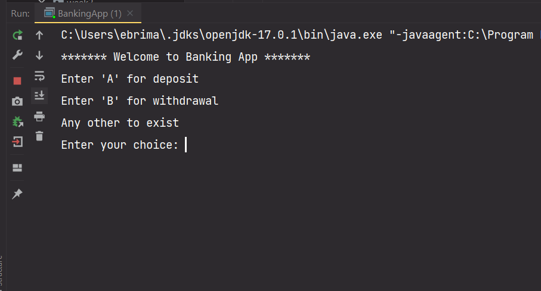

# Decision

One essential thing in programming is decision-making, which is why man relies heavily on computers. 

## Relational and Comparison Operator  

 Relational or comparison operators are used to compare number values(integer, and floating point values), they act on number values and evaluate to a boolean value. When you use a relational or comparison operator on number values you will always get a boolean out of the expression.

Below is a table showing 5 relational or comparison operator and their description:

| Operator | Name                      | Description                                                  |
| -------- | ------------------------- | ------------------------------------------------------------ |
| >        | Greater than              | It will compare the left operand against the right, return `true` if  it is greater than otherwise  `false` |
| <        | Less than                 | It will compare the left operand against the right, return `true` if  it less than otherwise  `false` |
| >=       | Greater than or equals to | It will compare the left operand against the right, return `true` if it is greater than or equals to otherwise  `false` |
| <=       | Less than or equals to    | It will compare the left operand against the right, return `true` if it is less than or equals to otherwise  `false` |
| ==       | Equals to                 | It will compare the left operand against the right, return `true` if they are equal otherwise  `false` |
| !=       | Not equals                | It will compare the left operand against the right, and return `true` if they are not equal  otherwise  `false` |


```java
/*
-----------------------------------------------------
Operator		|	Examples	|  Return value			
>				|	1 > 2		|  false
<				|	1 < 2		|  true
>=				|	2 >= 2		|  true
<=				|	3 <= 2		|  false
==				|	1 == 2		|  false
!=				|	1 != 2		|  true
*/

// You copy and paste the below code into your code editor to see the outcome
double a = 5, b = 10;
System.out.println(a > b)
System.out.println(a < b)
System.out.println(a >= b)
System.out.println(a <= b)
System.out.println(a == b)
System.out.println(a != b)
```

*Tip: Do not get sick of creating new projects to test our things. One project can contain one or more classes*

## Logical Operator

Logical operators are also regarded as `boolean` operators because they act on boolean values only, and therefor they return or evaluate to a `boolean` value as well. They are AND, OR, and NOT

Let's try to see them:

| Name | Symbol | Description                                                  |
| ---- | ------ | ------------------------------------------------------------ |
| AND  | &&     | These check the right-hand operand against the left-hand operand, and return `true` if both are values are `true` otherwise `false` |
| OR   | \|\|   | These check the right-hand operand against the left-hand operand, and return `true` if one of the value is `true` or both are `true` otherwise `false` |
| NOT  | !      | These operator is use to negate `boolean` values. It will return `true` when it is `false` and return `false` when it is `true` |

Let's see them:

Copy and paste the code snippets below

```java
public class LogicalOp {
    public static void main(String[] args) {
        System.out.println("Logical Operators");
        System.out.printf("%35s%n", "The Truth Table");
        System.out.printf("%-10s%n", "----------------------------------------------------------");
        System.out.printf("%-20s%-25s%s%n", "Operator(Symbol)", "Expression", "Evaluation");
        System.out.printf("%-20s%-25s%s%n", "AND (&&)", "true && true", (true && true));
        System.out.printf("%-20s%-25s%s%n", "AND (&&)", "true && false", (true && false));
        System.out.printf("%-20s%-25s%s%n", "OR (||)", "true || true", (true || true));
        System.out.printf("%-20s%-25s%s%n", "OR (||)", "true || false", (true || false));
        System.out.printf("%-20s%-25s%s%n", "NOT (!)", "!true", (!true));
        System.out.printf("%-20s%-25s%s%n", "NOT (!)", "!false", (!false));
    }
}
```

*Note: Here we are using `printf()` instead of `print() or println()`.*

The `printf()` will help us with indention, creating equal space when print multiple items on the same print statement. The `printf()` can take a minimum of two argument and a maximum of four argument , the first argument is the format and the rest are the items you want to print. The first argument `"%-20s%-25s%s%n"` have to be wrapped in a double quotation, the values `20` and `25` are for spacing, and they are only ones which can be change. You can change the number and see the spacing yourself.

Run your program:


### Some More Examples on Logical Operators

```java
public class MoreExampleOnLogicalOp {
    public static void main(String[] args) {
        int a = 20, b = 15, c = 35;

        boolean check1 = a > b || b == c;
        boolean check2 = a >= c && b != b;
        boolean check3 = b >= a || !(c == a);
        boolean check4 = !(c <= a && c >= a);
        boolean check5 = !(b >= a || c == a);

        System.out.println("Expression \t\t\t\t\tValue");
        System.out.println("a > b || b == c \t\t\t" +check1);
        System.out.println("a >= c && b != b \t\t\t" +check2);
        System.out.println("b >= a || !(c == a) \t\t" +check3);
        System.out.println("!(c <= a && c >= a) \t\t" +check4);
        System.out.println("!(b >= a || c == a) \t\t" +check5);
    }
}
```

Play with the code snippets above and see what it will evaluate to.

Let's look deep into some of the above expression:

* `a > b || b == c` this may seem to be executed by Java one-off. No, Java will extract out one expression before running the other:
  * Comparison operators have the highest rule of precedence than a logical operators
  * First execution: `a > b` will evaluate to `true` then `b == c` evaluate to `false`
  * Second execution: `true || false` which will evaluate to ` true`
* When parenthesis are involved: `b >= a || !(c == a)`
  * First execution: `b >= a` which will evaluate to `true`
  * Second execution: `!(c == a)` remember the BODMAS, Java will focus inside the parenthesis first, `c == d` which is `false` then inside the parenthesis `!(false)`, but Java will read it as  `!false` which will evaluate to `true`
  * Last execution: the value of the first execution `true`, the logical operator `||`, and the value of the second execution `true`: `true || true` is which `true`
* When every thing is wrap in a parenthesis(check4) `!(c <= a && c >= a)` still remember the BODMAS:
  * First execution: `c <= a` which will evaluate to `false`
  * Second execution: `c >= a`  which will evaluate to `true`
  * Third execution: `false && true` which will evaluate to `false`
  * Final execution: is whatever is inside the parenthesis `!(false)`, for Java is `!false` which will evaluate to `true`

## IF And Else Statement

## If Statement

An if statement is part of the control statements that takes a single boolean or multiples boolean values in its condition and execute what is in the body when the condition is `true`.

Let's see:

* Condition of the if statement: `if(condition)`
* Body comprises opening and closing brace and get executed when the condition is true: `if(condition){print}`

```java
boolean flag1 = true;
if(flag){
	System.out.println("Flag is true");
}
// Flag is true 

boolean flag2 = false;
if(flag2){
	System.out.println("Flag is true");
}
//
        
if(ture){
    System.out.println("Java is nice!");
}
// Java is nice
if(!ture){
    System.out.println("Java is nice!");
}
//
```

*Note! if you have a statement or an expression below an if statement it will execute regardless*

## If and Else Statement

This time we have a condition that we will be checked first then we have a fallback. As we have seen in the previous example we print in the console only when the condition is `true` and nothing is printed when it is `false`.

Here we can do it better, is not that a single `if` statement is not a good mechanism. Yes, it is in some situations.

Let's see:

*  Condition of the if statement: `if(condition)`
*  Body comprises opening and closing brace and get executed when the condition is `true`: `if(condition){print}`
*  Default `else`
*  Body of the else `else {print}`

Lets determined whether a person is given access or not depending on their age  

```java
int age = 17;
if(age >= 18){
	System.out.println("Access granted!");
} else {
	System.out.println("Access denied!");
}
// Access denied!
```

*Note! in an if and else statement something has to execute*

## If, Else if and Else Statement

This  is a great choice if you are checking for more than one conditions.

Let's see:

* The first condition of the if statement: `if(condition)`
* Body comprises  opening and closing brace and get execute when the condition is `true`: `if(condition){print}`
* The second condition `else if(firstCondition)`
* Body of the else if statement `else if(econdCondition) {print}`
* Default `else`
* Body of the else `else {print}`

Let's determine who the person is by checking for four possible scenarios 

```java
 int age = 46;
if(age < 10 ){
    System.out.println("Baby");
} else if (age >= 10 && age <= 17){
    System.out.println("Child");
} else if(age >= 18 && age <= 45){
    System.out.println("Youth");
} else {
    System.out.println("Adult");
}
// Adult
```

*Note! we use comparisons and logical operator to checked different range of conditions, you have to be really carefully using comparison and logical is one expression*

In the above we have tested 3 conditions and none seems to be `true`

## Nested If Statement

In a nested if statement we nest if statement inside an if statement. There is an outer and inner if statement, the inner statement got executed when the outer if statement condition is true.

Let's see:

```java
boolean flag = false;
     
     if(flag){
         int num = 100;
         if(num > 100){
             System.out.println("The number is greater than 100");
         } else{
             System.out.println("The number is not greater than 100");
         }
     } else {
         System.out.println("Oops!");
     }
```

*Note! we can use nested if statement for checking complicated conditions*

## Switch Statement

A switch works just the same as if statement, it has a condition and case(s) and a fallback which is the default.

Let's see:

* Condition of a switch `switch(condition)`
* Body comprises  opening and closing brace, some cases and a default : `switch(condition){case 1: print break; case 2: print break; default: print}`
* A `break` is control flow statement that will terminate or break out of the switch statement when a particular case is fulfilled 
* In every case your break if you don't break it will jump to the next case
* All the cases most have a break statement expect for the default

```java
int num = 100;

switch (num){
case 100:
   System.out.println("A");
   break;
case 20:
   System.out.println("B");
   break;
default:
   System.out.println("Non of the above!");
}
//A

  String userChoice = "A";
   switch (userChoice){
       case "A":
           System.out.println("Buy megabyte");           
       case "B":
           System.out.println("Buy megabyt for others");
           break;
       default:
           System.out.println("No thanks");
   }

// Buy megabyte
// Buy megabyt for others
```

*Note! switch statement cannot replace if statement in all situations*

In the above example two cases were printed because `case "A"` did not have a break statement.

## Refactoring

Let's continue with our Cash Power App. This time will add some decisions, we will make sure that the minimum amount to purchase cash power is `GMD30.00`.

Let's modify our code:

```java
import java.text.DecimalFormat;
import java.time.LocalDateTime;
import java.time.format.DateTimeFormatter;
import java.util.Random;
import java.util.Scanner;

public class CashPowerApp {
    public static void main(String[] args) {
        Scanner input = new Scanner(System.in);
        LocalDateTime currentDate = LocalDateTime.now();
        DateTimeFormatter dateFormatPattern = DateTimeFormatter.ofPattern("MM-dd-yyyy HH:mm:ss");
        DecimalFormat decimalFormat = new DecimalFormat("0.00");
        Random random = new Random();

        int random4Digits1 =  random.nextInt((9999 - 100) + 10) + 10;
        int random4Digits2 =  random.nextInt((9999 - 100) + 10) + 10;
        int random4Digits3 =  random.nextInt((9999 - 100) + 10) + 10;
        int random4Digits4 =  random.nextInt((9999 - 100) + 10) + 10;
        int random4Digits5 =  random.nextInt((9999 - 100) + 10) + 10;

        String tokens = random4Digits1+ " " +random4Digits2+ " " +random4Digits3+ " " +random4Digits4+ " " +random4Digits5;

        String formattedDate = currentDate.format(dateFormatPattern);
        String recieptNumber = "202303EIN005386482";
        String meterNumber = "0948842284921";
        String customer = "Lamin Njie";
        String tellerID = "0123";
        final double KWH = 0.1;
        double serviceFee = 1;
        double powerAmount;
        double totalUnits;

        System.out.print("Enter Amount: ");
        double amount = input.nextDouble();

        //check for the amount
        if(amount >= 30) {
            powerAmount = amount - serviceFee;
            totalUnits = powerAmount * KWH;

            System.out.println("************** NAWEC **************");
            System.out.println(formattedDate);
            System.out.println("Receipt Number: " + recieptNumber);
            System.out.println("Meter Number: " + meterNumber);
            System.out.println("Customer Name: " + customer.toUpperCase());
            System.out.println("Paid Amount: GMD" + String.format("%,.2f", amount));
            System.out.println("Power Amount: GMD" + String.format("%,.2f", powerAmount));
            System.out.println("Service Fee: GMD" + serviceFee);
            System.out.println("Total Units: " + decimalFormat.format(totalUnits) + "KWH");
            System.out.println("----------------------------------");
            System.out.println("\t\tToken Number \n \t" + tokens);
            System.out.println("---------------------------------");
            System.out.println("Teller ID: " + tellerID);
            System.out.println("Teller: LAMIN DIBBA");
        } else {
            System.out.println("The minimum amount to purchase cash power is GMD30.00");
        }
    }
}
```

In the above we put some conditions which make our App more robust. You see how powerful if statement can be. We only allow users to purchase cash power if their amount is `30` or more otherwise we print them a suitable error message. 

### Some More Example

Let's make use of a switch statement with SUNU BUNDLE Application.

```java
import java.util.Scanner;

public class SunuBundle {
    public static void main(String[] args) {
        Scanner input = new Scanner(System.in);

        System.out.println("**** Welcome to QCELL Sunu Bundle Service ****");
        System.out.println("Press 1 to buy Sunu Bundle");
        System.out.println("Press 2 to buy Sunu Bundle for others");
        System.out.println("Press 3 for Pay As You Go");
        System.out.println("Press 4 Reactivate Sunu Bundle");
        System.out.println("Press 5 Check Balance");
        System.out.println("Press 0 or any to Exit");
        System.out.println("");
        System.out.print("Enter your choice: ");
        String userChoice = input.next();


        double amount = 0;
        switch (userChoice){
            case "1":
                System.out.println("Buy Sunu Bundle");
                System.out.print("Enter amount: ");
                amount = input.nextDouble();
                System.out.println("You bought GMD" +String.format("%,.2f", amount)+ " for Megabyte");
                break;
            case "2":
                System.out.println("Buy Sunu Bundle for others");
                System.out.print("Enter amount: ");
                amount = input.nextDouble();
                System.out.print("Enter number: ");
                String number = input.next();
                System.out.println("You bought GMD" +String.format("%,.2f", amount)+ " for Megabyte for " +number);
                break;
            case "3":
                System.out.println("You have deactivated Sunu Bundle");
                System.out.println("You are now using Pay As You Go(with credit)");
                break;
            case "4":
                System.out.println("Reactivate Sunu Bundle");
                System.out.print("Enter amount: ");
                amount = input.nextDouble();
                System.out.println("You have bought GMD" +String.format("%,.2f", amount)+ " for Megabyte");
                break;
            case "5":
                System.out.println("Check Balance");
                System.out.println("Your balance is GMD20.00");
                break;
            default:
                System.out.println("No thanks");
        }

    }
}
```

In the above code snippets we use  a switch to develop a program in which we have 5 cases. In each case we are doing a specific operation

## Exercise 104

Your Banking App can take any amount as `deposit`, and `withdrawal` which is not the case in real life. likewise, you cannot withdraw more what you have in your `currentBalance`. Let's assume our Bank account can have a minimum  `GMD300.00` as it's  current balance

*Note: It makes sense to create a variable and store `300.00` since you will be using it a lot.*

Refactor your Banking App:

* By introducing a switch statement with two possible cases and a default 
* First case('a') is for deposit, take input from user(`amount`), update the `currentBalance`, and print out the account details
* Second case('b') is for withdrawal, take input from the user, update the `currentBalance` and print out the account details
* As for the default you might want to print 'No service available. Thank You!' 

After successfully refactoring, run your app

It should look like:



Refactor your code once more. Introduce a condition:

* By making sure users are not allowed to make a `deposit` less than  `GMD300.00`.
* By making sure users cannot withdraw less than `GMD300.00` 

The code snippets below is to demonstrate how you might check your condition:

```java
if(deposit < 300){
    System.out.println("Error has occurred!\n Minimum deposit amount is GMD300.00");
    break;
}
```

You can notice that the account details are also printed to the console with the error message.

* Refactor your App so that it print account details only when user enter an excepted deposit or withdrawal `amount`
* Use Java Date object to print transaction date `Date transactionDate = new Date()` to print the current date for every transaction invoke the `toLocaleString()` on the `transactionDate ` object

Your finish App should like:


If you try with option `b` for withdrawal and enter any desired amount you will end with a minus current balance value. We all know this is not realistic in World of Banking.

* Update your `currentBalance` to 1000
* Run your App and try with withdrawing this time, enter 800 as your amount you will end up with 200 as your `currentBalance`, and it can even be a negative value if you would withdraw more than `1,000.00`.
* Introduce a condition checking your `currentBalance` value, make sure it is not less than 300. If it is less than 300 do not allow users to make a withdrawal, print them a suitable error message and break the program.

Congratulations on making this far!

[Next lesson](https://github.com/touraye/under-doz/blob/main/102-looking-into-java/L-109-iterations.md)

[Previous lesson](https://github.com/touraye/under-doz/blob/main/102-looking-into-java/L-107-cash-power-app.md)

