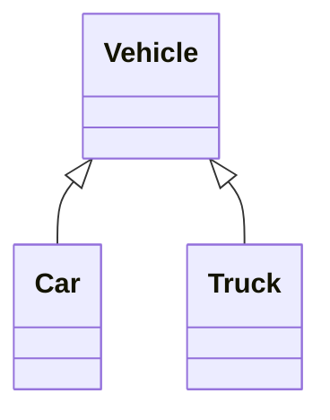

# Inheritance in Java

From the previous lesson we have learn the fundamental principal of **object oriented programming** and we have gain an insight of what **OOP** is. We have created **class** and then create create **objects** from a single class(blueprint). Here we will move the needle a little bit. We will learn how establish relationships between different class aka child-parent relationship.

What you will learn from these lesson:

* Inheritance in Java
* What is a parent class
* What is a child class
* How inheritance work
* Single and double inheritance


From a Text Book definition **inheritance** mean when an object(eg. a person) can inherit from another person. A typical example would be a child and a parent relationship, we all know a child is rightful successor of  their parent not only in terms of materialistic but other physical and behavioral features . Well, the understanding from the societal perspective is asserted. Let's look at this from a programming perspective(Java).

## Inheritance In Java

Inheritance in Java mean when a child class is driven from  a parent class thereby, a child class will possess whatever the parent has defined(state and behaviors). In Java inheritance is establish between a child class and a parent class using the **extends** keyword.

Class Diagram: The below diagram illustrate a simple relationship the exist in the world of vehicles.



The above class diagram show you; A parent class and two child classes, **Vehicle** is the parent class which is inherited by the **Car** and **Truck** class. The two child classes inherited from their parent class. If you don't know about automobiles well, everything that has a engine and can move is regarded a vehicle. So, therefore in the world of automobiles vehicle is the parent from which all other types of vehicles inherit from. A vehicle has a engine so does every other vehicle, can start, can stop, etc.

First and foremost we have to define a class like we used to. The class will represent a vehicle with a state and a behavior:

```java
class Vehicle {
    private String name;
    private String model;
    private int year;
    
    public Vehicle(String name, String model, int year){
        this.name = name;
        this.model = model;
        this.year = year;
    }
    
    // getters and setters
}
```

 *A regular class `Vehicle` with `private` instance variable *

