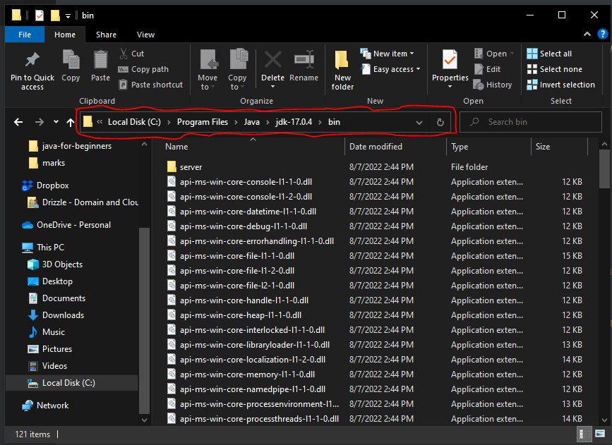
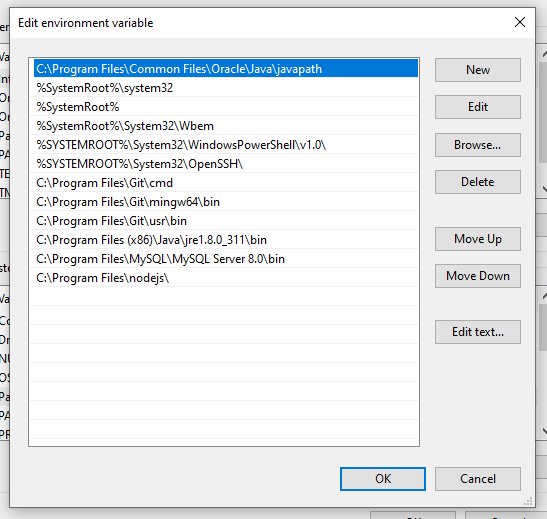

# Installation Of Basic Software

This unit will guide on the software to install

## How To Download Java

Well, there are many resources available on the internet, but I recommend using **Oracle** since they maintain Java. Java has evolved significantly, with many new features added to the language.

Java 23 is the newest version as of now, but I recommend [downloading Java 21](https://www.oracle.com/java/technologies/downloads/#java21). Java 21 is the current standard version and comes with long-term support (LTS). 

What do I mean by long-term support(LTS):
Software development involves updating existing features, adding new ones, and deprecating outdated ones. Every software goes through these phases, and Java is no exception. Java 21 includes the latest updated features that have been thoroughly tested and are free from bugs, making it suitable for real-time software development. However, the newest version, Java 22, does not have long-term support (LTS).

A version that does not have long-term support is released to the general public for testing. People will use it, report any issues, and the maintainers will fix those issues. These kinds of versions are not typically used by companies or individuals to build software.

To download Java on your Computer please follow this link [download java 17](https://www.oracle.com/in/java/technologies/downloads/#jdk17-windows), select your OS type , and proceed with your download.

### Why Do You Need To Download And Install Java 

To execute Java code on your computer, you need to install Java, which includes the Java Development Kit (JDK). Without the JDK, you will not be able to run Java code on your machine.

The JDK comprises other essential software, including the Java Virtual Machine (JVM) and the Java Runtime Environment (JRE)

Java Virtual Machine (JVM): This helps execute our bytecode or object code. As we discussed earlier, computers only understand machine code (low-level language), whereas Java is a high-level language. The JVM processes our bytecode into machine code so the CPU can execute it.

Java Runtime Environment: This contains classes and libraries with predefined logic. We will use these predefined classes and libraries in our Java program later on.

### Set Up Your Path 

Now we successfully downloaded and installed Java it's time to set up our development environment aka dev environment. We need to tell our computer where to find the Java we installed. *This is for only people running Windows computers* Mac OS and Linux take off everything.

In steps: 

* Open your window file explorer.
* Navigate to your C drive.
* Open your `program files` folder(this folder contain your installed programs).
* Find a folder named `Java` and open it.
* You should see one folder named `jdk-` with the version you installed in our case is 21, and open it suppose you've downloaded Java-21
* You will see a list of sub-folder and files, among you, should see a folder with the name of the `bin`, open the `bin` folder.
* Inside the `bin` folder, there are lots of sub-folders and files. See the preview:
  * 
* Click on the highlighted red color shown in the image above it will highlight everything in that address bar(think of it like how you copy a URL in your browser). `Ctrl+c` copy to highlighted text.
* Now we have to go to our Environment variables, press the `Windows key,` and type `env` you see 'Edit the system environment variables', and press on Enter key to open it.
* Advance tap will be selected by default, at the bottom you should see a button `Environment Variables` Click on it another window will open.
* There you will see the `User variables `(this will set the path to the only logged user), and System Variables(which will set the path for the entire system, and any user can access it). I prefer the `System Variables`.
* On the `System, Variables` select the `path` and click the `edit button `. Another small window will pop up. If it doesn't show like the image below go to the second instructions after the image.
  * The way my system shows it: 
  * 
  * You might not see all of the paths like the above, but it's ok. Click the `New` button a text area will be below the path, paste using `Ctrl+v` and then `Ok`.
  * The other way; all the paths will appear in one line separated by a semicolon. The last path might not have a semicolon at the end, but you have to put a semicolon before you can add any other path after it.
  * Add a to the last path, paste `Ctrl+v,` and then OK. That's it.

Verifying java which you installed would require the use of command line. simply navigate to part-a of [Module-0-booting up]() 

### Verify Java 

These are for all Operating Systems. Let's see whether Java is successfully installed on our computer. 

* Open your terminal or command prompt(on Windows: `windows key + r` then type cmd and OK)
* Type `java -version` and press on `enter key` this should show you the version of Java you have installed. Our case will be `java version "21" Date and  LTS`.
* Type `java` and press on the `enter key` a man-page will appear with some other useful commands. Believe it or not, we are done.

