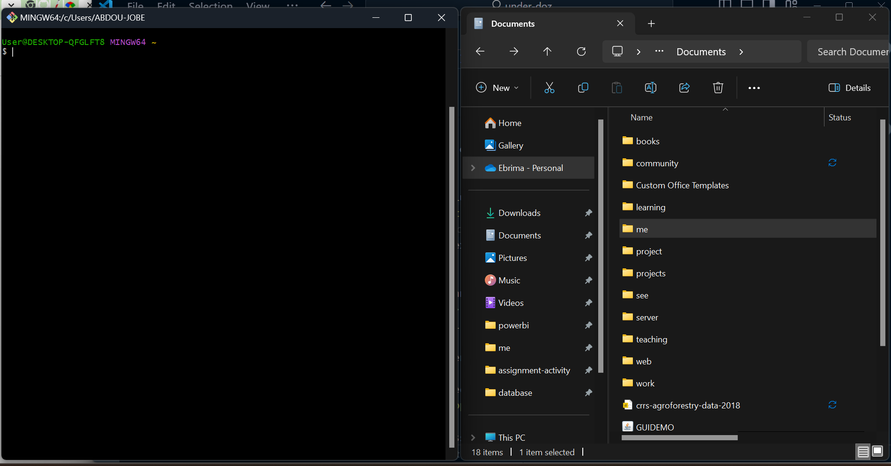

# Command Line Basic

## Command Line Basic

Here, you will explore the command line interface and learn how to manage files and folders by creating, renaming, moving, and deleting them. You will use the Command Prompt on Windows and the Terminal on Mac and Linux to carry out these tasks. Additionally, you will learn how to create Java classes, compile them, and execute programs directly from the command line.

## What is a command line:

 A command line is a text-based interface where users type commands to interact with the operating system or software, allowing tasks like file manipulation, program execution, and system configuration.

### features of a command line:

1. **Text-Based Interface**: Users input commands as text.
2. **Direct System Access**: Provides direct interaction with the operating system.
3. **Script ability**: Commands can be combined into scripts for automation.
4. **Efficiency**: Allows quick execution of complex tasks.
5. **Remote Access**: Can be used to control remote systems.
6. **Customizability**: Users can customize their environment with aliases, environment variables, and more.
7. **Powerful Utilities**: Offers powerful tools like file manipulation, process management, and network operations.

Types of command line: Each type serves different purposes and offers unique features depending on the user's needs and the operating system.

| Name                      | platform     | description                                                  |
| ------------------------- | ------------ | ------------------------------------------------------------ |
| Command Prompt (CMD)      | Windows      | The default CLI for Windows, used for file and system management. |
| PowerShell                | Windows      | A more advanced CLI and scripting environment for Windows, offering powerful automation capabilities |
| Bash (Bourne Again Shell) | Linux, macOS | A widely used shell in Unix-based systems, known for its powerful scripting and command capabilities |
| Zsh (Z Shell)             | Linux, macOS | An extended version of Bash with additional features like better customization and auto-completion. |
| Terminal                  | macOS, Linux | A generic CLI interface used to run shells like Bash, Zsh, etc. |
| TTY (TeleTYpewriter)      | Unix, Linux  | A low-level text interface providing direct system interaction. |
| CLI Tools and Interfaces  | Various      | Specific command-line tools or interfaces provided by software applications (e.g., Git CLI, Docker CLI) |

### Directory Management 

We have covered seven different types of command-line interfaces, but here, we will focus on just two: Command Prompt (CMD) and Terminal. I will demonstrate the commands for creating files and folders, moving them between directories, renaming them, and deleting them. Instead of a simple demonstration, I will make this an interactive session.

Some basic command we will be utilizing:

| Command | Platform       | Description                                                  |
| ------- | -------------- | ------------------------------------------------------------ |
| cd      | Both           | change directory - navigate from one directory to another back and forward. cd `name of the directory` will navigate you into that directory and `cd ..` will navigate your one step backward. |
| dir     | Command Prompt | List the content of directory/folder                         |
| ls      | Bash           | List the content of directory/folder                         |
| mkdir   | Both           | Make directory - this create a new directory/folder          |
| echo. > | Command Prompt | Create a new file - the command follow by the file-name      |
| touch   | Bash           | Create a new file - the command follow by the file name      |
| ren     | Both           | Rename file or a directory - command, current file/directory name, and new name separate by space |
| move    | Command Prompt | Move a file or a directory to a different directory          |
| mv      | Bash           | Move a file or a directory to a different directory          |
| del     | Both           | Delete - delete command is followed by the name of the file you wish to delete |

**Tip and Tricks of Command Line Interface**

The command-line interface serves as a representation of your file manager. To access all the contents of a directory, you must be inside that directory; otherwise, you will not have access to its contents. The same principle applies to the command line. One key thing to remember is your present working directory, which represents the currently opened folder in your file manager.

The present working directory may vary across different platforms. On Windows, you can check it using the Command Prompt by typing `cd` and pressing Enter, while on Unix-based systems (Mac and Linux), you can use the `pwd` command. In the command-line interface, the full directory path is displayed. For example:

```
C:\Users\ABDOU-JOBE\OneDrive\Documents\command-line-basic>
```

In this example, the present working directory is the `command-line-basic` folder.

There are two ways to interact with a command-line interface:

1. **Launching the program manually** – Open the Command Prompt (Windows) or Terminal (Mac/Linux) and navigate to any directory of your choice using the `cd` command.
2. **Using drag and drop** – Open the Command Prompt or Terminal, type `cd`, then drag and drop a folder into the window, and press the Enter key.

### **File and Folder Management - Command Prompt**

#### **Accessing the Command Prompt:**

- Open the Command Prompt window. Type `cd`, then drag and drop your `command-line-basic` folder into the command line and press **Enter**. Now, you can create files and folders inside `command-line-basic`.

#### **Creating Files and Folders/Directories:**

1. Navigate to your newly created folder using `cd command-line-basic`.

2. Create a directory named `t` using; `mkdir java`  

3. Create three new text files using the `echo >` command:

   ```
   echo > text-1.txt text-2.txt text-3.txt  
   ```

4. Run the `dir` command to confirm the files have been created.

#### **Moving Files and Folders/Directories:**

To move a file or directory, use the `move` command along with the destination folder. You can move files **forward** into a subdirectory or **backward** using `..` (dot notation) and the backslash (`\`).

1. Move `text-1.txt` into the `t` directory: `move text-1.txt t  `

   Then, navigate into `t` using: `cd t ` 

2. Move the file back to `command-line-basic`: `move text-1.txt ..\  `

3. The `move` command also works for directories. To move a directory one level up or down, use: `move foldername ..\.. ` 

#### **Renaming Files and Folders/Directories:**

- Renaming files and folders is simple with the `ren` command.

1. Rename a file: `ren text-2.txt renamed-text.txt`  
2. Rename the `t` directory inside `command-line-basic` to `t-folder`: `ren t t-folder ` 

#### **Deleting Files and Folders/Directories:**

- Use the `del` command to delete files: `del text-3.txt ` 
- Use `rmdir` to delete empty folders: `rmdir t-folder`  
- To delete a non-empty folder, use: `rmdir /s foldername  `


#### Terminal & Bash

Here's a refined version with improved grammar, clarity, and smoother transitions:

------

### **Using the Command Line on Mac and Linux**

If you're using **Mac** or **Linux**, the following commands will help you manage files and folders efficiently.

#### **Creating Files and Folders/Directories:**

- Use `mkdir` to create a folder/directory and `touch` to create a file.

1. Create a new directory called `command-line-basic`: `mkdir command-line-basic`  
2. Navigate to the newly created directory using the `cd` command: `cd command-line-basic`  
3. Create three new text files in a single command (separate filenames with spaces): `touch test-1.txt test-2.txt test-3.txt`  
4. List all the newly created files using: `ls`  

#### **Moving Files and Folders/Directories:**

The `mv` command moves files and folders to a specified destination.

1. Create a subdirectory named `t`: `mkdir t`  
2. Move `test-1.txt` into the `t` directory: `mv test-1.txt t`  
3. Verify the move by listing files inside `command-line-basic`: `ls`
4. Navigate into `t` and check its contents: `cd t` and `ls`

#### **Renaming Files and Folders:**

The `mv` command is also used to rename files and directories.

1. Rename `test-1.txt` inside `t` to `text-one.txt`: `mv test-1.txt text-one.txt`  
2. Navigate back to `command-line-basic`: `cd ..`  
3. Rename the `t` directory to `t-one`: `mv t t-one`  
4. Verify the changes: `ls`

#### **Deleting Files and Folders:**

- Use `rm` to delete files and `rm -rf` to delete directories.

1. Check your current directory using: `pwd` Ensure you are inside `command-line-basic`
2. If you list the contents, you should see two files (`test-2.txt` and `test-3.txt`) and the `t-one` directory: `ls`  
3. Delete `test-2.txt`: `rm test-2.txt`  
4. Confirm the deletion by running: `ls`  
5. Delete the `t-one` directory and all its contents: `rm -rf t-one`  
6. Run `ls` again to confirm that the directory has been removed.

## Java On The Command Line 

"Before installing an Integrated Development Environment (IDE) to write and compile our Java code, we will first learn how to use the command line along with Notepad to write and execute our first Java program."

Let's get into it:

*  Let's start by creating a directory/folder on the Desktop, preferably named **java**.

* **Mac and Linux:** Open the **Terminal** from your launcher.

* **Windows:** Launch the **Command Prompt**.

* Ensure both windows are positioned side by side so that they are visible on your screen for easy navigation:

  * 

* Type `cd` in your terminal or command prompt and then space

* Drag and drop your Java folder in the terminal or command prompt. You should see something like this 'cd C:\Users\ebrima\Desktop\java' then click on the enter key this should take you to the java directory/folder.

* Mac and Linux: Let's confirm we are sitting in the right directory, type `pwd` and these should show up as `/c/Users/ebrima/Desktop/java`. Of course a different username, mine is ebrima. For Windows use `cd` and enter

* Create a new file `Main.java` using the `echo >` for Windows and `touch` for Mac and Linux

* Run the `ls` command for Mac and Linux and `dir` Windows to see the file you just created.

* Using the command line to open the `Main.java`: First the name of the application and then the file name

  * Windows: type `notepad Main.java`. you will see `ECHO is on.` inside. Remove it.

  * Mac and Linux: type `notepad Main.java` 

* Copy the following code snippets and paste them into your file opened in Notepad then `Ctrl+s` to save.

  ```java
  public class Main {
  	public static void main(String[] args){
  		System.out.println("Hello World!");
  }
  }
  ```

* To review the content of Main.java in the command line:

  * Windows: Run `type Main.java`

  * Mac and Linux: Run `cat Main.java` 

* Now we will compile the `Main.java` file by invoking the Java compiler; `javac Main.java`. A successful compilation nothing will show up after running the command other the error will be printed.

* Run `dir` for Windows and `ls` for Mac and Linux you should see two file all the same name `Main` but different file extensions. One with `.java` and the other with `.class` 

* Next is to execute the `Main.java` file not one with `.class` extension. Run `java Main.java` this should print a `Hello World!` text in your command line. 

* Congratulations if you see Hello World! You have successfully compile and execute a Java code.

* Let's modify our program a bit, move to Notepad, copy the code below, and paste the code below the first print statement.

* ```java
  System.out.println(2+2)
  ```

* Save it, go to your terminal, and run `javac Main.java` to compile it again. Am sure this time an error is going to be thrown at you because we don't terminate `;` the print statement we just added. Have spotted it?

* Correct the error, save it, compile it, and execute it you should see Hello World! and 4.

## Summary

* You are have learned what is a command line interface, it's power wheel, some of the commands, and of course its use cases. 
* You have learned basic file and folder management using the command line(command prompt and terminal)
* You have learn how to use the command-line plus a simple text-editor to create a Java file, compile and execute.