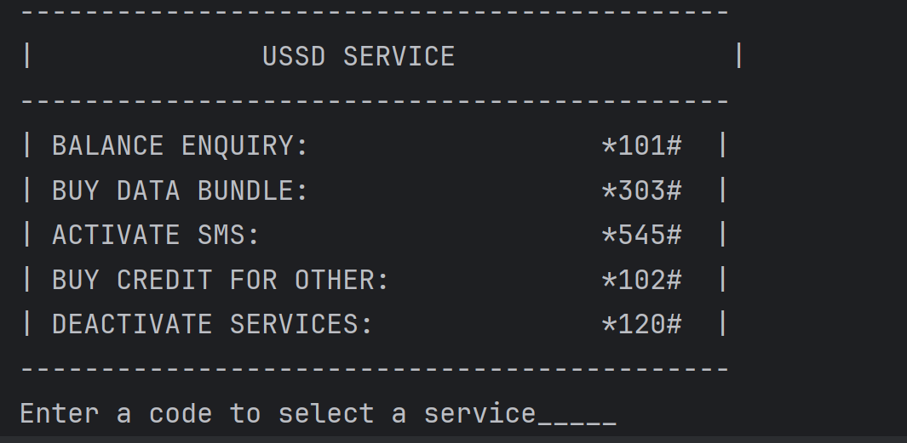

# Unstructured Supplementary Service Data (USSD) 

Have you ever wonder how your phone carriers allows you to access their services directly on your phone by just typing a ussd come;  `*101# `. This code is among some of the many codes that allows you to either buys a airtime, data buddle, sub for SMS, activate a service or even deactivate service. 

Below is a sub-menu, the copy for this can be found below:




```java
System.out.println("--------------------------------------------");
System.out.println("|              USSD SERVICE                 |");
System.out.println("--------------------------------------------");
System.out.println("| BALANCE ENQUIRY:                  *101#  |");
System.out.println("| BUY DATA BUNDLE:                  *303#  |");
System.out.println("| ACTIVATE SMS:                     *545#  |");
System.out.println("| BUY CREDIT FOR OTHER:             *102#  |");
System.out.println("| DEACTIVATE SERVICES:              *120#  |");
System.out.println("--------------------------------------------");
System.out.print("Enter a code to select a service_____");
```

## Task:

Develop a program a user can interact with that mimic USSD program in your phone:

1. Create a project called USSD and `class` named `Main`. Do not forget to include a `main` method.

2. Initialize a `Scanner` object to be able to take input from the keyboard.

3. Declare a variable called `code` that will told the USSD code a user have to enter.

4.   Hence the USSD code will be one of the above codes, use one **conditional statements** check for individuals code.

5. For each code correspond it to its right block or case; depending on your implementation.

6. For example if a user type in `*101#` your respond should be a print statement like:

   ```java
   System.out.println("--------------------------\n" +
           "|     BALANCE ENQUIRY    |");
   System.out.println("--------------------------");
   System.out.println("Your credit is GMD: 50.68");
   System.out.println("Your SMS is 75");
   System.out.println("Your free bonus is 34.55");
   ```

   *Copy and paste the above code snippets in your corresponding block or case*

7. Make sure all your blocks cases have a unique print statement.

8. Provide a default block or case to take care of the wrong USSD.

Happy coding!

​	
