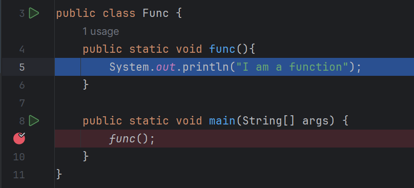

# Functional Programming

Up to this point in the course, we've been writing programs where instructions are executed one after another, from top to bottom. You might have observed that in doing so, certain blocks of code end up being repeated. For instance, think about how often we've used System.out.println() to display information on the console. This module introduces a powerful concept: functions (or 'methods' as they're commonly known in Java). We'll learn to create these reusable blocks of code to perform specific tasks, allowing us to call upon them whenever needed, rather than rewriting the same logic repeatedly.

Topic to cover:

1. What is functional programming
2. What is a function
3. Function definition
   1. Modifier
   2. Return type
   3. Name of a function
   4. Parameter list
   5. statement
4. Function invocation
5. Function expression
6. Parameter and Argument
7. Pass by value and references
8. Function as a input

## Functional Programming

Before we **begin** our journey into the world of functions, **it's** good **to** grasp the idea behind **them**. Programs can be written **without incorporating** functions, but they make **coding a lot** easier.

**Functional programming** is a programming paradigm were software codes are chunked in small modules called a **function**. 

## What is Function

A function is reusable chunk of code that group logic in a single unit with a distinct name and return type as far as Java is concerned. A function those nothing but just to execute instructions found within its block whenever called or invoked, a function might return a value or not. Th is instruction that a function execute when invoke are the very kind of instructions you have writing so far. 

## Function Definition

To create a function a lot have to come into play; is far as Java is concern a function must have: access modifier, return type, name, parameter list and block were instructions are place in a form of expression (s) and statement (s). Java unlike other programming language there is no *function keyword* 

```java
modifiers return-type name ( parameter-list ) {
	statements 
}
```

Lets take learn about each:

1. **Access Modifier:** Tell us more about the characteristic of function and there dozen of them, but we will look into only two for now:
   1. `public` it indicate that the function will be publicly available to other class to access and modifier 
   2. `static` indicates that the function will be invoke without creating an object of the class where is it created.
2. **Return Type:** Since Java is a static type language (every must have a *type*). However, a function do not necessarily have a type like how variables do. Whenever a function is invoke it does is computation and can return a value or not. Whether a function would return a value or not that has to be explicitly indicate by the program at the function creation times. When a function is returning an integer the *return-type* is `int` and a `return` keyword etc. but when it is not returning any value the *return-type* is `viod`
3. **Name:** Like your class and variables function too must have a *name* and it is distinct. Java creates a function which you called each time you write a program called the `main()` function or method. So therefore, your functions are going to be distinct by their names. Naming your function will be base what they are doing.
4. **Parameter List:** Like how a function might return a value or not, it can also define a parameter (variable). Whether a function would return a value or not it has nothing to do with a parameter. A parameter is just a placeholder a function would receive when called, it can be more one each with a comma separation.
5. **Statement:** These are instructions that are wrapped within a [block `{}`](). A function like `if, else, switch` and iterative statements  all uses a block to group their logic as a single unit.

Lets define our first function:

```java
public class Func {
    static void func(){
		System.out.println("I am a function");
    }
}
```

The code snippet above is a function definition by the name `func` with a return type of void, and  print statement within its block. This function has not use any memory as of now simply because is not called or invoke.

Before we move further lets remind ourselves about the *memory management in Java; the stack and the heap memory*. The **stack memory** is where all the reference variable and primitives are going to me stored including functions. The function above is not  yet registered in the **stack memory**.

### Function invocation

Functions are invoke or called by their names along with a mandatory parenthesis `()` by doing so a function is registered in the **stack memory**. Let call the `func` function in our `mian` method, run your program in a debugger mode and see it yourself:



As illustrated above; line number 9 had a pointer and when the execute reaches it  it jump to the `fun` function is define and execute the print statement found within its block. This is typical example how functions behaves.

Function's that returns a values must have a return type as stated above and of course a return keyword that return a value of specify type. Lets turn the `func` function to return "I am a function" as a value rather than printing it. Meaning we have to change the function:

1. The return type from `void` to `String`
2. Remove the print statement and replace it with `return "I am a function";`

```java
public static String func(){
    return "I am a function";
}
```

If you just refactored the `func` function and you run your program don't be surprise don't to see anything printed in the console.

### Function Expression

Whenever a function has a `return` statement it is actually returning a value. This kind of function invocation is known as a function expression, remember [expression produces a value]() after computation, and this function also is returning a value once it is executed. Before we assign it to a variable lets declare a print statement and pass the function call right direct:

```java
public static void main(String[] args) {
    System.out.println(func());
}
// I am a function
```

As expression always return a value so, it will not be sensible just to have an expression like `2 * 2` without assigning the derived value to a variable. Our function call is also like `2 * 2` without assigning it to variable:

```java
public static void main(String[] args) {
    String fromFunc = func();
    System.out.println(fromFunc);
}
```

### Parameter and Arguments

Wouldn't the `func` function be more dynamic if it has to take input from the caller (you, who's calling) and return it. A function can take a input and give output as demonstrated with the `return` statement. 

A parameter is a placeholder of what a function might receive  while argument is the actual value that is pass (as an input) in to a function. So, therefore a parameter is define at function creation time as a normal variable, while an argument is pass in to a function when called or invoke:

```java
public static String func(String arg){
    return arg;
}
```

The `func` function has changed; a variable named `arg` of type `String` is defined as parameter within its parameter-list and its `return` statement now return the parameter `arg`. 

Function can take more that one argument. To do so define more than one parameter in the parameter-list, with a comma separation, and passing argument would require a separation. Create a `sum` function that receive two arguments, add them and return their sum.

Its also possible for a function to take arguments of different types: create function called `myInfo`, define two parameters; `name` and `yearOfBirth`, and you print them to the console.

Note! a function return type is not dictated by the parameter (s) it defines.

### Pass by Value and 

Calling the `func` function would require an argument to be pass in. Well there are two ways to do this; a **value** of variable could be pass

* **Pass by value:** When a primitive variable is pass to a function as an argument only its value is available to a function. Suppose the function modify the value, the original value is not modify

  ```java
  public static  void modifyFun(int val) {
      val = 2 * 2;
  }
  public static void main(String[] args) {
      int val = 0;
      System.out.println("Before modifying val: " +val);// 0
      modifyFun(val);
      System.out.println("After modifying val: " +val);// 0
  }
  ```

In the `main` method a variable name `val` is assigned with a value of `0`, this variable is pass to a function name `modifyFun`. The `modifyFun` received its value and updated it; `val = 2 * 2;` so `val = 4`. Anyway, in the `main` method we have seen the value `val` remains the same despite the `modifyFun` reassign `4` to `val` in fact this change is only with the scope of `modifyFun`, once the `modifyFun` is executed it is removed from the call stack leaving the `val` unchanged

* **Pass by references:** Unlike **pass by value**, when a reference of a variable is pass to an argument i.e **pass by reference** to a function the reference itself is available to to the function, so any update by the function to the variable affect it entirely:

  ```java
  class Person{
      String name;
  
      Person(String _name){
          name = _name;
      }
  }
  
  
  public class PassByValRef {
      // update function
      static void updateFunc(Person person){
              person.name = "Ahmed Dicko";
      }
      
      public static void main(String[] args) {
          Person person = new Person("Ahmed");
          System.out.println("Person Name: " +person.name); //Ahmed
          updateFunc(person);
          System.out.println(person.name);//Ahmed Dicko
      }
  }
  ```

  As shown above, unlike primitives the `person` is a **referential** type when they are pass to a function their reference is passed. The `updateFun` receive a reference of `person` object as an argument  and assigned a new value, full name to it and that effect the `person` entirely. 

The `func` function is invoked twice and each time an argument is pass to it. Notice! The `func` function can be invoke as many as you wish and off course it is not tied to only one value. 

The `func` function can be extended to take more than one value;  define two variables in the parameter-list named `name` and `birthYear`. 

### Function As a Input

When function `a` return an integer value and function take the same integer. It is not possible for function `b` to take function as its argument? Yes, it is. 

Let's get back to our `func` function. Suppose you have done the challenge and you passed `Ahmed Dick` as `name` and `2005` as `yearOfBirth` then  the print in console is:

```java
My name is Ahmed Dick, and I was born in 2005.
```

Let's make the small program more fun, lets make it possible to calculate the age of a person.

Here is a function that take `year` as an argument, calculate the time period from that year to the current year. Suppose you are born in 2005 then your age will be 20:

```java
static int ageCalculator(int year) {
    if (year < 1900) {
        throw new IllegalArgumentException("You are too old for our program");
    }

    int currentYear = LocalDate.now().getYear();
    int age = currentYear - year;
    return age;
}
```

The `func` function has now change, `name` and `age` are passed in:

```java
public static void func(String name, int age){
        System.out.println("My name is " +name+ " and I am " +age+ " years old");
    }
```

Why it is that the `func` function receive `age` instead of year? Well `ageCalculator` now take `year` and returns `age`, so therefore, it worth passing `ageCalculator` as argument to `func` function.

Calling `func` function:

```java
public static void main(String[] args) {
    func("Ahmed Dick", ageCalculator(2005));
}
```

`ageCalculator` is passed in as a input to the `func` function. Putting a pointer at `func` call and run it in a debugger mood will not give you the full picture of the call-stack. 

Let's refactor this code and call `ageCalculator` inside `func` function, and pass it the `yearOfBirth`:

```java
public static void func(String name, int yearOfBirth){
    System.out.println("My name is " +name+ " and I am " +ageCalculator(yearOfBirth)+ " years old");
}
```

The `ageCalculator` will remain the same. The only change is the `func` function, the one above and:

```java
func("Ahmed Dick",2005);
```

Running this in a debug mood will make things more interesting about the call-stack:

1. `func` function is called 

2. The execution is then pass to `ageCalculator` with `yearOfBirth`

   1. This function expression `LocalDate.now().getYear();`  will take the execution to `LocalDate` class which will the `getYear` method and return the current year
   2. The execution return to `ageCalculator` with the current year that got assign to the `currentYear`, below person age is calculate.
   3. The `ageCalculator` return age to were it was called, `func` it place the age value that very portion i.e the person age is printed.

3. 1. Finally, the execution is returned back to the main method printing when is printed inside of the `func` function.

   